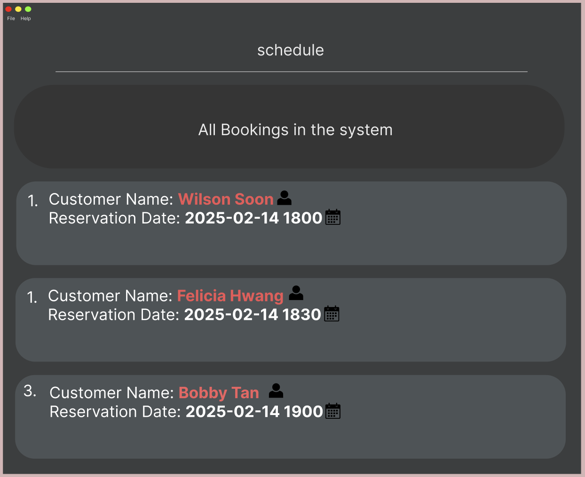

[](https://github.com/AY2425S2-CS2103-F08-1/tp/actions)

[](https://codecov.io/gh/AY2425S2-CS2103-F08-1/tp)



# ReserveMate User Guide

## Table of Contents
1. [Introduction](#introduction)
2. [Features](#features)
3. [Command Summary](#command-summary)
4. [Acknowledgement](#acknowledgement)

## Introduction
Welcome to **ReserveMate**, your go-to application for managing reservations efficiently. ReserveMate helps you track **reservation details**. This guide provides instructions on how to use ReserveMate effectively.

## Features
ReserveMate supports a variety of commands to help you manage your reservations:

### Feature: Create a new reservation
**Purpose:** The create function will enable users to add new reservations to reserve by capturing relevant details such as name, number of diners, contact information, date and time of reservation.

**Command format:** `add n/<NAME> p/<PHONE> e/<EMAIL> x/<NUMBER_OF_DINERS> d/<DATETIME> <o/OCCASION>...…​`

**Example commands:**
```
add n/John Doe p/98765432 e/johnd@example.com x/5 d/2025-04-12 1800 o/Birthday
ADD n/John Doe e/johnd@example.com x/5 d/2025-04-12 1800 o/Anniversary
```

### Feature: Editing a reservation
**Purpose:** The edit function will enable users to edit existing reservations by specifying the detail(s) of the reservation to be changed.

**Command format:** `edit <INDEX> [n/NAME] [p/PHONE] [e/EMAIL] [x/NUMBER_OF_DINERS] [d/DATETIME] [o/OCCASION]…​`

**Example commands:**
```
edit 1 n/John Doe p/98765432 e/johnd@example.com x/5 d/2025-04-12 1800 o/Birthday
EDIT 1 n/John Doe e/johnd@example.com x/5 d/2025-04-12 1800 o/None p/98765432
edit 1 d/2022-04-12 1800
```

### Feature: Saving customer preferences
**Purpose:** Saving customer preferences for a specific reservation.

**Command format:**
- To save: `pref save <INDEX> <PREFERENCE_TEXT>`

**Example commands:**
```
pref save 3 Allergic to seafood
PREF save 3 Prefers window seat
```

### Feature: Delete reservation by reservation number
**Purpose:** To delete a reservation.

**Command format:** `delete <INDEX> cfm`

**Example commands:**
```
delete 2 cfm
Delete 2 cfm
```
### Feature: Show Reservation details
**Purpose:** Show details of a specific reservation to user.

**Command format:** `show <INDEX>`

**Example commands:**
```
show 1
Show 1
```

### Feature: View Reservation list
**Purpose:** Allow the user to view the entire reservation schedule without specifying a date range.

**Command format:** `list`

**Example commands:**
```
list
List
```

### Feature: View list of commands
**Purpose:** Display the available list of commands to the user.

**Command format:** `help`

**Example commands:**
```
help
Help
```

### Feature: Display statistics of reservations
**Purpose:** Display the statistics of reservations: number of reservations per number of diners in a bar chart.

**Command format:** `stats`

**Example commands:**
```
stats
Stats
```

### Feature: Find reservation by name
**Purpose:** Get reservation information easily

**Command format:** `find <RESERVATION NAME>`

**Example commands:**
```
find Bobby
Find Bobby
```

### Feature: Filtering reservation between dates
**Purpose:** View reservations between 2 dates more easily

**Command format:** `filter sd/<DATETIME> ed/<DATETIME>`

**Example commands:**
```
filter sd/2025-04-01 1400 ed/2025-04-02 1800
Filter sd/2025-04-01 1400 ed/2025-04-02 1800
```

### Feature: View all free time slots for a specific day
**Purpose:** View all free time slots for reservation for a specific day.

**Command format:** `free <DATE>`

**Example commands:**
```
free d/2025-04-28
Free d/2025-04-28
```

### Feature: Clearing all reservations
**Purpose:** Deletes all reservations in ReserveMate.

**Command format:** `clear`

**Example commands:**
```
clear
Clear
```

### Feature: Exiting the application
**Purpose:** Terminates the application when no longer in use.

**Command format:** `exit`

**Example commands:**
```
exit
Exit
```

## Command Summary
| Feature                     | Command Format                                                                              | Purpose                                                                                |
|-----------------------------|---------------------------------------------------------------------------------------------|----------------------------------------------------------------------------------------|
| Create a new reservation    | `add n/<NAME> p/<PHONE> e/<EMAIL> x/<NUMBER_OF_DINERS> d/<DATETIME> [o/OCCASION]…`          | Add new reservation to ReserveMate                                                     |
| Editing a reservation       | `edit <INDEX> [n/NAME] [p/PHONE] [e/EMAIL] [x/NUMBER_OF_DINERS] [d/DATETIME] [o/OCCASION]…` | Edit existing details of a reservation                                                 |
| Delete reservation          | `delete <INDEX>`                                                                            | Remove a reservation from ReserveMate                                                  |
| Show Reservation details    | `show <INDEX>`                                                                              | Show details of reservation to user                                                    |
| View all free time slots    | `free`                                                                                      | View all free time slots for reservation within a window of 60 days from current time. |
| View reservation list       | `list`                                                                                      | View the entire reservation schedule                                                   |
| View help list              | `help`                                                                                      | Display the available list of commands to the user                                     |
| Find reservation by name    | `find <RESERVATION NAME>`                                                                   | Retrieve reservation information                                                       |
| Manage preferences          | `pref save <INDEX> <PREFERENCE_TEXT>`                                                       | Saves reservation preferences                                                          |
| Clearing all reservations   | `clear`                                                                                     | Deletes all reservations in ReserveMate                                                |
| View reservation statistics | `stats`                                                                                     | Display reservation statistics of ReserveMate                                          |
| Filter reservations by date | `filter sd/<DATETIME> ed/<DATETIME>`                                                        | Display reservations between given dates                                               |
| Exiting the application     | `exit`                                                                                      | Terminates the application                                                             |

### Acknowledgement
This project is based on the AddressBook-Level3 project created by the [SE-EDU initiative](https://se-education.org).

