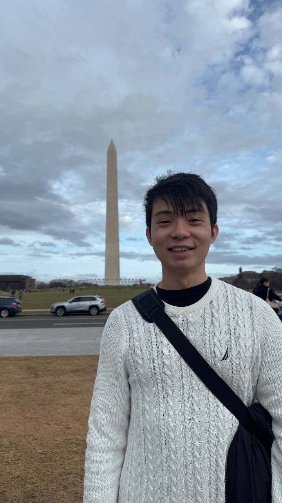
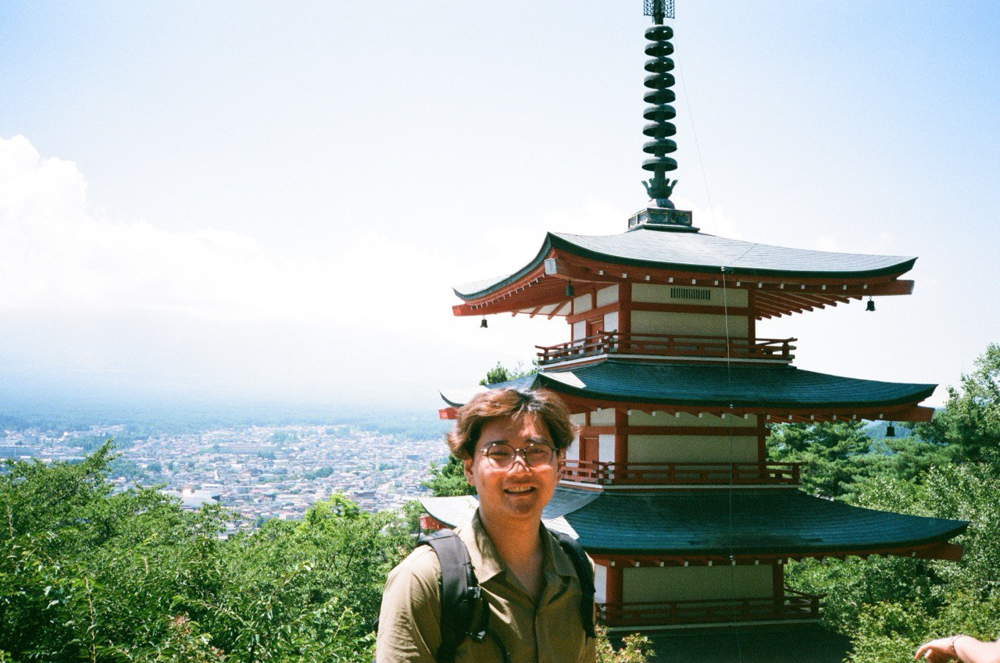
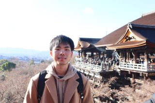
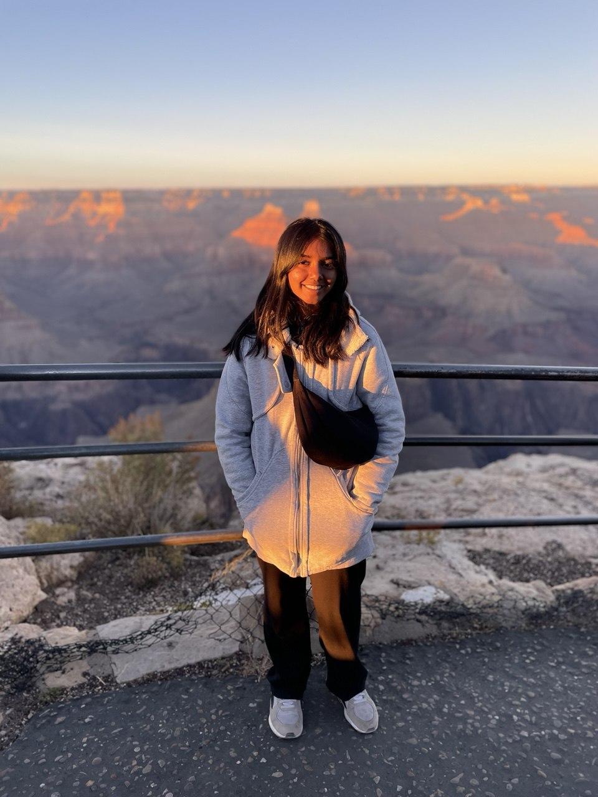
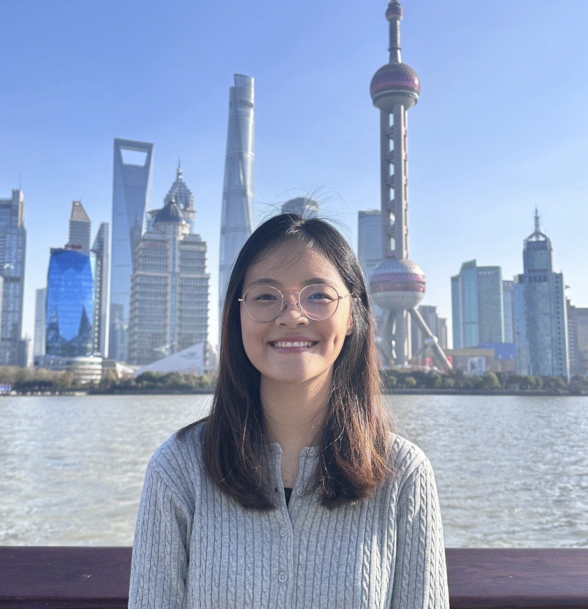

# About Us

We are a team based in the [School of Computing, National University of Singapore](http://www.comp.nus.edu.sg).

You can reach us at the email `seer[at]comp.nus.edu.sg`

## Project team

### Johannsen Lum

[[linkedin](https://www.linkedin.com/in/johannsenlum/)]
[[github](https://github.com/johannsenlum)]
[[portfolio](team/johannsenlum.md)]

* Role: Documentation

### Kai Jun

[[homepage](https://www.linkedin.com/in/kai-jun-tay-01475b195/)]
[[github](https://github.com/Kaidama97)]
[[portfolio](team/kaidama97.md)]

* Role: Developer, Testing
* In charge of: `commands`

### Basil

[[homepage](https://www.linkedin.com/in/basil-boh-81933b18b/)]
[[github](https://github.com/basil-boh)]
[[portfolio](team/basil-boh.md)]

* Role: Goat
* Responsibilities: Ensure project deliverables are done on time and in the right format

### Fong Kai Jie

[[homepage](https://www.linkedin.com/in/fong-kai-jie/)]
[[github](https://github.com/codebreaker64)]
[[portfolio](team/kaijie.md)]

* Role: Developer
* Responsibilities: Code Quality

### Sridhar Pooja

[[github](http://github.com/wowwwp)]
[[portfolio](team/wowwwp.md)]

* Role: Developer
* Responsibilities: Deliverables and deadlines

### Felicia Hwang

[[linkedin](https://www.linkedin.com/in/feliciahmq/)]
[[github](https://github.com/feliciahmq)]
[[portfolio](team/feliciahmq.md)]

* Role: Documentation
