# ReserveMate Developer Guide

## Table of Contents
- [Acknowledgements](#acknowledgements)
- [Setting up, getting started](#setting-up-and-getting-started)
- [Design](#design)
  - [Architecture]()
  - [UI component](#ui-component)
  - [Logic component](#logic-component)
  - [Model component](#model-component)
  - [Storage component](#storage-component)
  - [Common classes](#common-classes)
- [Implementation](#implementation)
  - [Delete Feature](#delete-feature)
  - [Add Reservation Feature](#add-reservation-feature)
  - [Proposed Undo/Redo Feature](#proposed-undoredo-feature)
- [Documentation, logging, testing, configuration, dev-ops](#documentation-logging-testing-configuration-dev-ops)
- [Appendix: Requirements](#appendix-requirements)
  - [Product scope](#architecture)
  - [User stories](#user-stories)
  - [User cases](#use-cases)
  - [Non-functional Requirements](#non-functional-requirements)
  - [Glossary](#glossary)
- [Appendix: Instructions for manual testing](#appendix-instructions-for-manual-testing)
  - [Launch and shutdown](#launch-and-shutdown)
  - [Deleting a reservation](#clearing-data)
  - [Saving data](#saving-data)

--------------------------------------------------------------------------------------------------------------------

## **Acknowledgements**
This project is based on the **AddressBook-Level3**
project created by the [SE-EDU initiative](https://se-education.org).

Generative AI tools (ChatGPT, GitHub Copilot and DeepSeek) were used for:
- Ideation and creation of JUnit test cases
- Generating method name suggestions
- Writing detailed Javadoc comments

The format of the Developer Guide was inspired by the Developer Guide of the past project
  [ArchDuke](https://ay2122s2-cs2103-w16-3.github.io/tp/DeveloperGuide.html) and
  [InTrack](https://ay2223s1-cs2103t-t11-2.github.io/tp/DeveloperGuide.html).

--------------------------------------------------------------------------------------------------------------------

## **Setting up and getting started**

Refer to the guide [Setting up and getting started](https://se-education.org/addressbook-level3/SettingUp.html).

--------------------------------------------------------------------------------------------------------------------
## **Design**
💡 Tip: The .puml files for generating diagrams in this document are located in the [diagrams](https://github.com/AY2425S2-CS2103-F08-1/tp/tree/master/docs/diagrams) folder.
For guidance on creating and modifying these diagrams, check out the [PlantUML Tutorial](https://se-education.org/guides/tutorials/plantUml.html) for more info.

### Architecture

The ***Architecture Diagram*** below illustrates the high-level structure of the application.

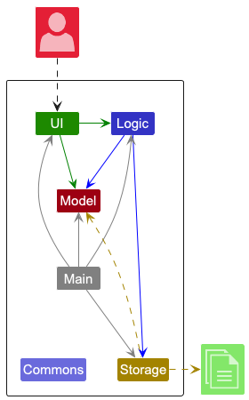

**Overview of Main Components of the architecture**

**`Main`** contains two key classes:
[Main](https://github.com/AY2425S2-CS2103-F08-1/tp/blob/master/src/main/java/seedu/reserve/Main.java) and
[MainApp](https://github.com/AY2425S2-CS2103-F08-1/tp/blob/master/src/main/java/seedu/reserve/MainApp.java), which are responsible for,
* Application Startup: Ensuring all components are initialized in the correct order and properly linked.
* At shut down: Managing the termination of components and executing necessary cleanup operations.

[**`Commons`**](#common-classes) serves as a collection of shared classes that are utilized by multiple components
within the application.

The Application is further structured into four core components:

* [**`UI`**](#ui-component): The UI of the Application.
* [**`Logic`**](#logic-component): Processes User commands.
* [**`Model`**](#model-component): Manages in-memory application data.
* [**`Storage`**](#storage-component): Reads data from, and writes data to, the hard disk.

**Interaction between Architecture Components**

The *Sequence Diagram* below illustrates how the main components interact when processing a typical command,
such as `delete 1 cfm`.

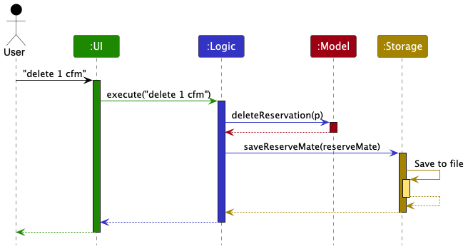

Each of the four components (illustrated in the diagram above) follows a structured design pattern:

* Each component defines its `interface`, ensuring a well-defined *API* for interaction.
* The implementation of each component follows this interface using a corresponding **manager class**.
* For instance, the `Logic` component defines its interface in `Logic.java` and implements its functionality in
`LogicManager.java`.
* Other components interact with a given component through its interface rather than its concrete
implementation. This approach minimizes coupling, making the system more modular and maintainable, as illustrated
in the (partial) class diagram below.

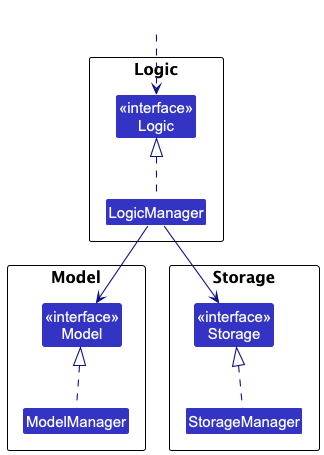

**Detailed overview of Components**

The following sections provide an in-depth explanation of each major component in the
system, including their responsibilities and how they interact with other parts of the application.

### UI Component

The **UI Component** is responsible for handling user interactions. Its API is defined in
[`Ui.java`](https://github.com/AY2425S2-CS2103-F08-1/tp/blob/master/src/main/java/seedu/reserve/ui/Ui.java)

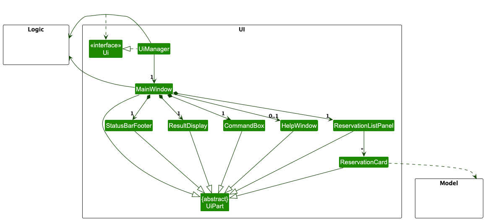

The UI consists of a `MainWindow` that is composed of multiple subcomponents, including:
* `CommandBox`
* `ResultDisplay`
* `ReservationListPanel`
* `StatusBarFooter`
* `HelpWindow`

All these components, including `MainWindow`, inherit from the abstract `UiPart` class, which captures the
commonalities between different UI elements.

**Framework and layout**

The UI is built using the **JavaFx UI framework**. The layout of UI elements defined in .fxml is located in the
`src/main/resources/view` folder. For example, the layout for `MainWindow` is specified in `MainWindow.fxml`.

**Responsibilities**

The UI Component performs the following key functions:
* Executing User Commands: It forwards user input to the `Logic` component for processing.
* Listening for Data Changes: It observes updates in the `Model` component to refresh the displayed data dynamically.
* Maintaining a Reference to Logic: The UI keeps a direct reference to `Logic` component since it relies on
it to execute commands.
* Displaying Model Data: It depends on some classes from the `Model` component to render `Reservation` objects
stored in memory.


### Logic Component

The **Logic Component** is responsible for interpreting user input, executing commands, and managing interactions
between `Ui`, `Model`, and `Storage` components. Its API is defined in
[`Logic.java`](https://github.com/AY2425S2-CS2103-F08-1/tp/blob/master/src/main/java/seedu/reserve/logic/Logic.java).

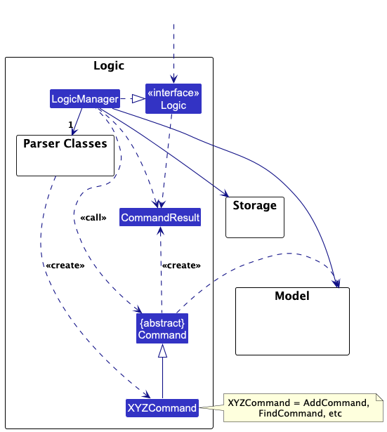


**Command Execution Flow**
1. The UI component calls the `Logic` interface when a user enters a command.
2. `LogicManager` delegates the command parsing to an `ReserveaMateParser` object which in turn creates a parser that
matches the command (e.g, `DeleteCommandPaser`) and uses it to parse the command.
3. Once parsed, `LogicManger` executes the `Command` object, which may interact with the `Model` component to
update reservation data.
4. The `Command` object returns a `CommandResult`, encapsulating feedback on the execution outcome.
5. `LogicManager` forwards the `CommandResult` to the UI component, which updates the display accordingly.

The sequence Diagram below illustrates the interactions within the `logic` component for the `execute("delete 1 cfm")
API call.

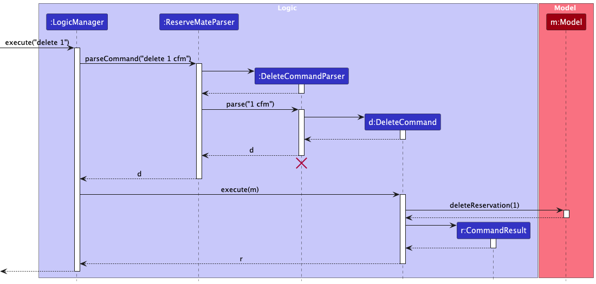

💡 **Note:** The lifeline for `DeleteCommandParser`
should end at the destroy marker (X) but due to a limitation of PlantUML, the lifeline reaches the end of the diagram.

Here are the other classes in `Logic` (omitted from the class diagram above) that are used for parsing a user command:

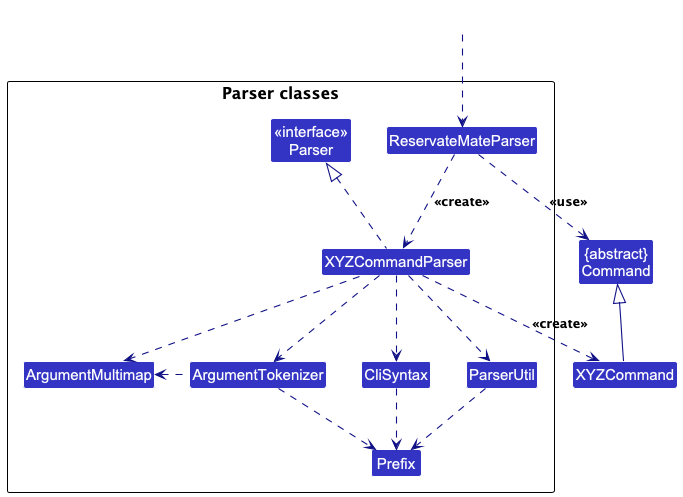

How the parsing works:
* When called upon to parse a user command, the `ReserveMateParser` class creates an `XYZCommandPaser` (`XYZ` is a
placeholder for the specific command name e.g., `AddCommandParser`) which uses the other classes shown above to parse
the user command and create a `XYZCommand` object (e.g., `AddCommand`) which the `ReservateMateParser` returns back as
a `Command` object.
* All `XYZCommandParser` classes (e.g., `AddCommandParser`, `DeleteComandParser`,...) inherits from the `Parser`
interface so that they can be treated similarly where possible e.g, during testing.

### Model Component

Its API is defined in:
[`Model.java`](https://github.com/AY2425S2-CS2103-F08-1/tp/blob/master/src/main/java/seedu/reserve/model/Model.java)

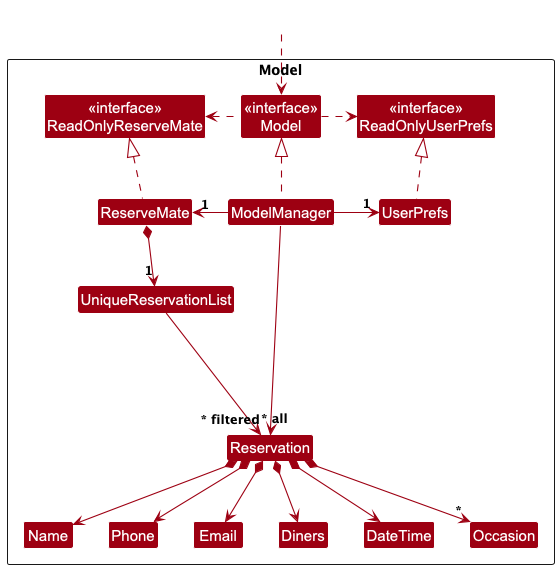

The `Model` component,
* Stores the reserve mate data i.e, all `Reservation` objects (which are contained in a
`UniqueReservationList` object).
* Stores the currently 'selected' `Reservation` object (e.g., results of a search query) as a separate *filtered* list
which is exposed to outsiders as an unmodifiable `ObservableList<Reservation>` that can be 'observed' e.g. the UI can be
bound to this list so that the UI automatically updates when the data in the list change.
* Stores a `UserPref` object that represents the user's preferences. This is exposed to the outside as a
`ReadOnlyUserPref` object.
* Does not depend on any of the other three components (as the `Model` represents data entities of the domain, they
should make sense on their own without depending on other components)

💡**Note:** An alternative (arguably, a more OOP)
model is given below. It has a `Occasion` list in the `ReserveMate`, which `Reservation` references. This allows
`ReserveMate` to only require one `Occasion` object per unique occasion, instead of each `Reservation` needing their
own `Occasion` objects.<br>

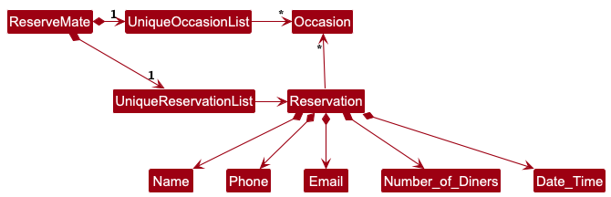


### Storage component

Its API is defined in:
[`Storage.java`](https://github.com/AY2425S2-CS2103-F08-1/tp/blob/master/src/main/java/seedu/reserve/storage/Storage.java)

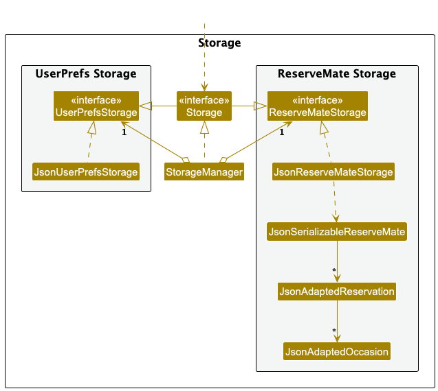

The `Storage` component,
* Can save both reserve mate data and user preference data in JSON format, and read them back into corresponding
objects.
* Inherits from both `ReserveMateStorage` and `UserPrefsStorage`, which means it can be treated as either one (if
only the functionality of only one is needed).
* Depends on some classes in the `Model` component (because the `Storage` component's job is to save/retrieve objects
that belong to the `Model`)


### Common classes

Classes used by multiple components are in the `seedu.reserve.commons` package.

--------------------------------------------------------------------------------------------------------------------

## Implementation

This section describes some noteworthy details on how certain features are implemented.

### Add Reservation Feature

The add reservation feature allows users to add reservations easily via the command `add n/NAME p/PHONE_NUMBER e/EMAIL x/NUMBER_OF_DINER d/DATE_TIME [o/OCCASION]…`.

#### How it is implemented

The `add` command utilizes `AddCommand` and `AddCommandParser`. `AddCommandParser#parse(String args)` uses `ArgumentTokenizer#tokenize(String argString, Prefix... prefixes)`
to extract the relevant inputs for each field. A new `Reservation` object is then created with the corresponding reservation name, phone number, email, date,
number of diners and occasion(s) if provided. If occasion(s) are not provided, it would be initialized to an empty set. The `ModelManager#addReservation(Reservation reservation)`, which implements the `Model` interface, 
adds the `Reservation` into the reservation list. 

#### Parsing the user input

1) The user inputs the `add` command.
2) The `ReserveMateParser` creates a `AddCommandParser` and calls its `parse` method.
3) The `AddCommandParser#parse(String args)` uses `ArgumentTokenizer#tokenize(String argString, Prefix... prefixes)` to extract out relevant arguments. If any of 
the compulsory arguments are missing, a `ParseException` detailing the expected format is thrown.
4) The `Name`, `Phone`, `Email`, `Diners`, `DateTime` and `Occasion` parsers would check the validity of the inputs. If any of the inputs are invalid,
a `ParseException` detailing why the given argument is invalid is thrown. If all the relevant inputs are valid, a new `Reservation` object is created.
5) The `AddCommandParser#parse(String args)` creates a `AddCommand` object with the new `Reservation` object.

#### Command Execution
1) The `LogicManager#execute(String commandText)` executes the `AddCommand`.
2) The `AddCommand` calls `ModelManager#addReservation(Reservation reservation)` to add the reservation into the reservation list. If the provided reservation
is already present in the reservation list, a `CommandException` is thrown.

#### Displaying the result
A new `CommandResult` with the success message is created and is returned to `LogicManager`. The GUI would be updated.

The following sequence diagram shows how the `add` command works:

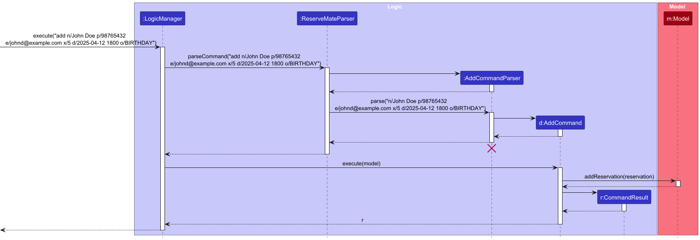

> 💡 **Note:** The lifeline for `AddCommandParser` should end at the destroy marker (X) but due to a limitation of PlantUML,
> the lifeline reaches the end of the diagram.

The following activity diagram shows what happens when a user executes a `add` command:

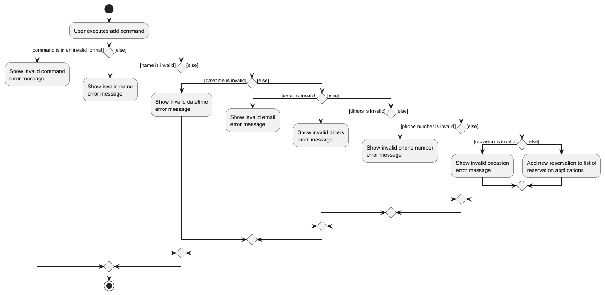

#### Design Considerations

##### Making occasion tag optional

While occasion tag is useful for some reservations, there will be others which do not require it. Instead of making the user
add occasions when not needed, it was made optional to improve user experience.

--------------------------------------------------------------------------------------------------------------------

### Delete feature

The delete feature allows restaurant managers to delete any unwanted or accidental reservations via the command `delete
<INDEX> cfm`.

#### How is it implemented

The delete functionality is implemented through the `DeleteCommand` class. The feature is primarily made up of the
following components:

1. `DeleteCommand` - Delete the reservation based on index shown on the list.
2. `DeleteCommandParser` - Parses and validates the user input into a `DeleteCommand` object.

#### Parsing the user input

1. The user enters a command in the format `delete <INDEX> cfm`.
2. The `LogicManager` passes the command string to `ReserveMateParser`.
3. `ReserveMateParser` identifies the command as a `delete` command and delegates to `DeleteCommandParser`.
4. `DeleteCommandParser` extracts and validates the index. If the index or `cfm` is missing, a parse
exception will be thrown.
5. `DeleteCommandParser` will create `DeleteCommand` object with the index. 

#### Command execution

1. `LogicManager` calls the `execute()` method of the `DeleteCommand` object.
2. The `DeleteCommand` will delete the reservation based on the index from the `Model`.

#### Displaying the result

A new `CommandResult` with the success message is created and is returned to the `LogicManager`. The GUI would be
updated.

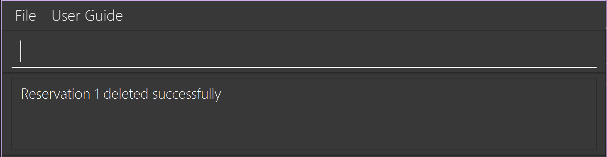

The following sequence diagram shows how the delete command works:


> 💡 **Note:** The lifeline for `DeleteCommandParser` should end at the destroy marker (X) but due to a limitation of PlantUML,
> the lifeline reaches the end of the diagram.

#### Design Considerations

##### Making user type `cfm`

To prevent accidental deletions due to typing the wrong index, users are required to confirm their action by entering
an additional 'cfm'. This extra step gives them time to double-check the index they’ve entered.

### [Proposed] Undo/redo feature

The proposed undo/redo mechanism is facilitated by `VersionedReserveMate`. It extends `ReserveMate` with an undo/redo
history, stored internally as an `reserveMateStateList` and `currentStatePointer`. Additionally, it implements the
following operations:

- VersionedReserveMate#commit() - Saves the current reserve mate state in its history.
- VersionedReserveMate#undo() - Restores the previous reserve mate state from its history.
- VersionedReserveMate#redo() - Restores a previously undone reserve mate state from its history.

These operations are exposed in the `Model` interface as `Model#commitReserveMate()`, `Model#undoReserveMate()` and
`Model#redoReserveMate()` respectively.

Given below is an example usage scenario and how the undo/redo mechanism behaves at each step.

Step 1. The user launches the application for the first time. The `VersionedReserveMate` will be initialized with the
initial reserve mate state, and the `currentStatePointer` pointing to that single reserve mate state.

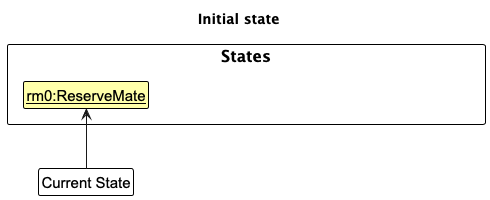

Step 2. The user executes `delete 5 cfm` command to delete the 5th person in reserve mate. The `delete` command calls
`Model#commitReserveMate()`, causing the modified state of reserve mate after the `delete 5 cfm` command executes to be
saved in the `reserveMateStateList`, and the `currentStatePointer` is shifted to the newly inserted reserve mate state.

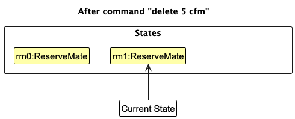

Step 3. The user executes `add n/John ...` to add a new reservation. The `add` command also calls
`Model#commitReserveMate()` causing another modified reserve mate state to be saved into the `reserveMateStateList`.

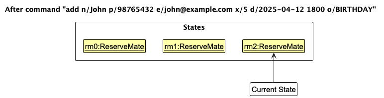

> 💡 **Note:** If a command fails its execution, it will not call `Model#commitInTrack()`, so the reserve mate state
> will not be saved into the `reserveMateStateList`.

Step 4. The user now decides that adding the new reservation was a mistake, and decides to undo that action by executing
the `undo` command. The `undo` command will call `Model#undoReserveMate()`, which will shift the `currentStatePointer`
once to the left, pointing it to the previous reserve mate state, and restores reserve mate to that state.


> 💡 **Note:** If the `currentStatePointer` is at index 0, pointing to the initial reserve mate state, then there are no
> previous reserve mate states to restore. The `undo` command uses `Model#canUndoReserveMate()` to check if this is the
> case. If so, it will return an error to the user rather than attempting to perform the undo.


The following sequence diagram shows how the undo operation works:

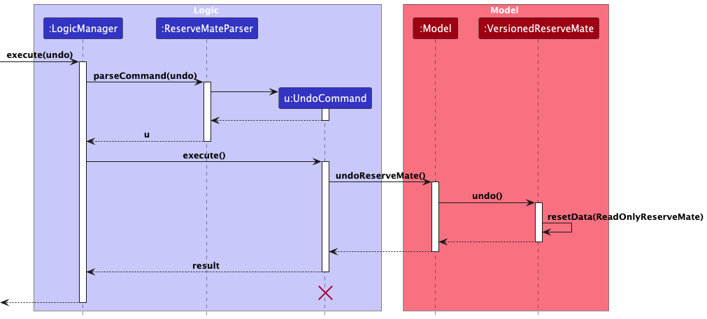

> 💡 **Note:** The lifeline for `UndoCommand` should end at the destroy marker (X) but due to a limitation of PlantUML,
> the lifeline reaches the end of the diagram.

The `redo` command does the opposite - it calls `Model#redoReserveMate()`, which shifts the `currentStatePointer` once
to the right, pointing to the previously undone state, and restores the reservemate to that state.

> 💡 **Note:** If the `currentStatePointer` is at index `reservemateStateList.size() - 1`, pointing to the latest
> reserve mate state, then there are no undone reserve mate states to restore. The `redo` command uses
> `Model#canRedoReserveMate()` to check if this is the case. If so, it will return an error to the user rather than
> attempting to perform the redo.

Step 5. The user then decides to execute the command `list`. Commands that do not modify the reserve mate, such as
`list`, will usually not call `Model#commitReserveMate()`, `Model#undoReserveMate()` or `Model#redoReserveMate()`. Thus,
the `reserveMateStateList` remains unchanged.

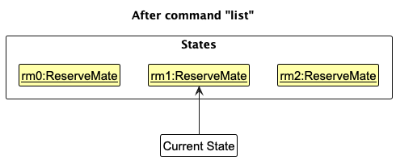

Step 6. The user executes `clear`, which calls `Model#commitReserveMate()`. Since the `currentStatePointer` is not
pointing at the end of the `reserveMateStateList`, all reserve mate states after the `currentStatePointer` will be
purged. We designed it this way because it no longer makes sense to redo the `add n/John ...` command. This is the
behavior that most modern desktop applications follow.

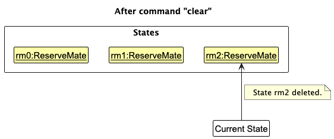

The following activity diagram summarizes what happens when a user executes a new command:

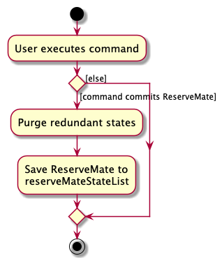

#### Design considerations:

**Aspect: How undo & redo executes:**

* **Alternative 1 (current choice):** Saves the entire reserve mate.
  * Pros: Easy to implement.
  * Cons: May have performance issues in terms of memory usage.

* **Alternative 2:** Individual command knows how to undo/redo by itself.
  * Pros: Will use less memory (e.g. for `delete`, just save the reservation being deleted).
  * Cons: We must ensure that the implementation of each individual command are correct.


--------------------------------------------------------------------------------------------------------------------

## Documentation, logging, testing, configuration, dev-ops
- [Documentation guide](https://github.com/AY2425S2-CS2103-F08-1/tp/blob/master/docs/Documentation.md)
- [Testing guide](https://github.com/AY2425S2-CS2103-F08-1/tp/blob/master/docs/Testing.md)
- [Logging guide](https://github.com/AY2425S2-CS2103-F08-1/tp/blob/master/docs/Logging.md)
- [Configuration guide](https://github.com/AY2425S2-CS2103-F08-1/tp/blob/master/docs/Configuration.md)
- [DevOps guide](https://github.com/AY2425S2-CS2103-F08-1/tp/blob/master/docs/DevOps.md)

--------------------------------------------------------------------------------------------------------------------

## Appendix: Requirements

**Team**: F08-1

**Name**: ReserveMate

**Target User Profile**: Our application is designed for small restaurant owners who have to manage numerous customer reservations and contact details. These users often operate in fast-paced environments and need a simple yet effective system to organize all reservations.


**Value Proposition**: ReserveMate provides small restaurant owners with a fast and intuitive way to manage reservation and customer contact details through a Command Line Interface (CLI). This enhances operational efficiency by streamlining organisation and ensuring easy access to reservation details.


### User stories

Priorities: High (Must have) - `* * *`, Medium (Good to have) - `* *`, Low (Extension) - `*`

| Priority | As a …             | I want to …                                                                            | So that I can…                                                      |
|----------|--------------------|----------------------------------------------------------------------------------------|---------------------------------------------------------------------|
| `* * *`  | Frequent user      | Delete reservations by customer name                                                   | Quickly remove a cancelled booking                                  |
| `* * *`  | Productive user    | Know how many diners for each reservation                                              | Plan the seating arrangement beforehand                             |
| `* * *`  | Beginner           | Enter reservations using a simple command format                                       | Quickly add customers without getting overwhelmed                   |
| `* * *`  | Beginner           | View a list of commands within the app                                                 | Don’t have to remember them all                                     |
| `* * *`  | Hardworking user   | View the schedule                                                                      | Know when are the reservations                                      |
| `* *`    | frequent user      | filter reservations by date and time,                                                  | I can check upcoming bookings easily                                |
| `* *`    | frequent user      | blacklist customers who repeatedly cancel or don’t show up                             | I can manage reservations more effectively and avoid late customers |
| `* *`    | Advanced user      | Sort reservations by table number                                                      | Optimise seating arrangements                                       |
| `* *`    | Beginner           | Navigate around the app using minimal keystrokes                                       | Learn how to use the app quickly                                    |
| `* *`    | Beginner           | Receive confirmation prompts before deleting a reservation                             | Don’t accidentally remove a customer                                |
| `* *`    | Forgetful user     | Know shortcuts to different actions                                                    | Look up the input format every time I use the app                   |
| `* *`    | Impatient user     | Find free time slots                                                                   | Quickly schedule reservations                                       |
| `* *`    | Thoughtful user    | Reschedule reservations                                                                | Accommodate customer needs                                          |
| `* *`    | Long-time user     | Sort reservations in ascending date order                                              | Know when customers are arriving                                    |
| `* *`    | Long-time user     | Search for reservations                                                                | Get customer information easily                                     |
| `* *`    | Long-time user     | Update reservations                                                                    | Change reservations based on customer requests                      |
| `* *`    | Beginner user      | Receive a notification when double-booking a table                                     | Avoid booking conflicts                                             |
| `* *`    | Long-time user     | Store and manage customer contact details securely                                     | Protect customer privacy and ensure communication                   |
| `* *`    | Frequent user      | Sort reservations by table type (e.g. window seat, private room)                       | View reservations by seating preference                             |
| `* *`    | Long-time user     | Occasion reservations by special request (e.g. Birthday, Allergy)                      | Handle them accordingly                                             |
| `* *`    | Forgetful user     | Automatically record customer preferences (e.g. dietary restrictions, seating choices) | Provide better service without relying on memory                    |
| `* *`    | Cost-conscious user| Set up reservation deposit requirements                                                | Reduce cancellations and ensure customer commitment                 |
| `* *`    | Overwhelmed user   | Automatically decline overbooking requests                                             | Don’t have to manually reject customers                             |
| `*`      | Advanced user      | Export reservation data to a CSV file                                                  | Review past bookings or analyse trends                              |
| `*`      | Overwhelmed user   | Archive reservations                                                                   | Gather insights on customers                                        |
| `*`      | Productive user    | See statistics on customers                                                            | Identify regular customers                                          |
| `*`      | Long-time user     | Send automated reminders and confirmations                                             | Reduce last-minute cancellations                                    |
| `*`      | Frequent user      | Add custom shortcuts for frequently used commands                                      | Increase efficiency                                                 |
| `*`      | Frequent user      | See visuals of booked tables and available seats                                       | Assign tables to customers easily                                   |
| `*`      | Beginner user      | Add table size for each type of table                                                  | Organise seating more effectively                                   |


### Use cases

(For all use cases below, the **System** is the `ReserveMate` and the **Actor** is the `user`, unless specified otherwise)

**Use case: UC01 - View Reservation's Details**

**MSS**

1. User performs <u>View Reservations (UC05)</u> to view all reservations.

2. User requests to view a specific reservation's details.

3. ReserveMate displays the reservation's details as a message.

    Use case ends.

**Extensions**

* 1a. User enters an invalid command.

    * 1a1. ReserveMate shows an error message.

      Use Case ends.

* 2a. User enters an invalid index.

    * 2a1. ReserveMate shows an error message.

      Use case resumes at step 2.

--------------------------------------------------------------------------------------------------------------------

**Use case: UC02 - Create A New Reservation**

**MSS**

1. User requests to create a new reservation.

2. User enter reservation details.

3. ReserveMate validates the input.

4. ReserveMate adds the reservation and confirms success.

    Use case ends.

**Extensions**

* 3a. User enters invalid input.

    * 3a1. ReserveMate shows an error message.

    * 3a2. User re-enters the reservation details.

    * Steps 3a1 - 3a2 are repeated until user input is valid.

      Use case resumes at step 4.

* 3b. User enters a duplicate reservation.

    * 3b1. ReserveMate display the duplicate reservation error message.

    * 3b2. User modifies the reservation details.

    * Steps 3b1 - 3b2 are repeated until the reservation details are unique.

      Use case resumes at step 4.

--------------------------------------------------------------------------------------------------------------------

**Use case: UC03 - Listing Commands**

**MSS**

1. User requests to view all available commands.

2. ReserveMate displays the list of available commands to user.

    Use case ends.

**Extensions**

* 1a. User enters an invalid command format.

    * 1a1. ReserveMate shows an error message

      Use case ends.

--------------------------------------------------------------------------------------------------------------------

**Use case: UC04 - Delete Reservation**

**MSS**

1. User requests to delete a reservation by providing an index and a confirmation.

2. ReserveMate deletes the particular reservation.
    Use case ends.

**Extensions**

* 1a. The index is invalid.

  * 1a1. ReserveMate prompts the user to enter a valid index.

    Use case resumes at step 1.

* 1b. Confirmation not given

  * 1b1. ReserveMate prompts the user to confirm the deletion

    use case resumes at step 1.

* 1c. User enters an invalid command format.

  * 1c1. ReserveMate shows an error message providing the correct format.

    use case resumes at step 1.

--------------------------------------------------------------------------------------------------------------------

**Use case: UC05 - View Reservation list**

**MSS**

1. User requests to view all reservations.

2. ReserveMate retrieves and displays all existing reservations.

    Use case ends.

**Extensions**

* 1a. User enters an invalid command.

  * 1a1. ReserveMate shows an error message.

    Use Case ends.

* 2a. The list of reservations is empty.

  * 2a1. ReserveMate shows an error message.

    Use case ends.

--------------------------------------------------------------------------------------------------------------------

**Use case: UC06 - Find Reservation by Name**

**MSS**

1.  User enters name to find reservation.

2.  ReserveMate shows a list of reservation where customer name contains the entered name.

    Use case ends.

**Extensions**

* 1a. ReserveMate detects an error in the entered data.

  * 1a1. ReserveMate requests for the correct data format.

  * 1a2. User enters new data.

  * Steps 1a1-1a2 are repeated until the data entered are correct.

    Use case resumes from step 2.

* 1b. ReserveMate found no matches.

  * 1b1. ReserveMate shows No reservation found for NAME.

    Use case ends.

--------------------------------------------------------------------------------------------------------------------

**Use case: UC07 - Edit a Reservation**

**MSS**

1. User requests to edit a reservation by providing an index and new details.

2. ReserveMate checks if the reservation has not passed the current date and time.

3. ReserveMate updates the reservation with new details.

4. ReserveMate displays success message with updated reservation details in the reservation list.

    Use case ends.

**Extensions**

* 1a. User enters an invalid command format.

  * 1a1. ReserveMate shows an error message providing the correct format.

    Use case resumes at step 1.

* 2a. The user given index is not a valid reservation.

  * 2a1. ReserveMate shows invalid reservation index error.

      Use case resumes at step 1.

* 2b. The reservation date has already passed.

  * 2b1. ReserveMate shows cannot edit past reservation error.

      Use case ends.

* 3a. The new user details would cause duplicate reservation.

  * 3a1. ReserveMate shows duplicate reservation message.

      Use case resumes at step 1.

--------------------------------------------------------------------------------------------------------------------

**Use case: UC08 - View all free time slots**

**MSS**

1. User requests to view all free time slots for a specific day.

2. ReserveMate retrieve all free time slots for the specific day and displays them to User.

    Use case ends.

**Extensions**

* 1a. User enters an invalid command.

  * 1a1. ReserveMate shows an error message.

    Use Case ends.

* 2a. The reservation list is empty.
 
  * 2a1. ReserveMate shows an error message.

    Use case ends.

--------------------------------------------------------------------------------------------------------------------

**Use case: UC09 - Filter Reservations**

**MSS**

1. User requests to filter reservations between two given dates.

2. ReserveMate displays reservations that falls within given dates

    Use case ends

**Extensions**

* 1a. The user enters an invalid command.

  * 1a1. ReserveMate shows an error message.

    Use case resumes at step 1.

* 1b. The user enter invalid date(s)

  * 1b1. ReserveMate shows an error message.

  * 1b2. User enters new dates.

  * Steps b1-1b2 are repeated until valid dates are provided.

    Use case resumes at step 2.

* 2a. ReserveMate found no reservations between the 2 dates.

  * 2a1. ReserveMate displays No reservations found for the date range.

--------------------------------------------------------------------------------------------------------------------

**Use case: UC10 - Manage Reservation Preferences**

**MSS**

1. User requests to save a preference for a specific reservation by providing an index and preference text.

2. ReserveMate saves the preference for the specified reservation.

3. ReserveMate displays a success message.

   Use case ends.

**Extensions**

* 1a. The user enters an invalid command format.

  * 1a1. ReserveMate shows an error message providing the correct format.

    Use case resumes at step 1.

* 2a. The specified index is invalid.

  * 2a1. ReserveMate shows an invalid reservation index error message.

    Use case resumes at step 1.
  
* 3a. Preference text description exceeds 50 characters.

  * 3a1. ReserveMate displays an error message indicating preference text must be less than 50 characters.

    Use case resumes at step 1.
  
* 4a. No preference has been set for the reservation.

  * 4a1. ReserveMate displays "None", indicating no preference has been set.

    Use case ends

--------------------------------------------------------------------------------------------------------------------

**Use case: UC11 - Viewing statistics**

**MSS**

1. User enters command to display reservation statistics.

2. ReserveMate displays a new window containing the reservation statistics, a bar chart grouped by number of diners.

   Use case ends.

**Extensions**

* 1a. User enters an invalid command format.

    * 1a1. ReserveMate shows an error message.

      Use case ends.

* 2a. There is no reservation data available.

    * 2a1. ReserveMate shows an empty chart indicating that there are no reservations to summarize.

      Use case ends.


--------------------------------------------------------------------------------------------------------------------

### Non-Functional Requirements
1) The system should be primarily command-line based.
2) A user who can type fast should be able to accomplish tasks faster through this system compared to using
one which relies on the mouse.
3) The system can be used by a user who can understand and write english easily with a minimal learning curve.
4) The system should use Gradle as a build automation tool, and it must run on any OS which has Java 17.
5) All reservation details will be stored in a file saved locally which should allow read and write access to the
system.
6) All code pushed into the repository must adhere to checkstyle to ensure readability and maintainability.
7) The system is designed for a single-user.
8) The response to any commands carried out by the user should become visible within 5 seconds.
9) The user is not required to have an internet connection in order for the application to function.
10) Data should be stored consistently even after closing and reopening the app.
11) Should work on any mainstream OS as long as it has Java 17 installed.

### Glossary

* **User**: Restaurant manager using ReserveMate
* **Mainstream OS**: Windows, macOS, Linux, Unix
* **Reservation**: Reservation details of the customer

--------------------------------------------------------------------------------------------------------------------

## Appendix: Instructions for manual testing

Given below are instructions to test the app manually.

💡 **Note:**
These instructions only provide a starting point for testers to work on;
testers are expected to do more *exploratory* testing.


### Launch and shutdown

1. Initial launch

   1. Download the jar file and copy into an empty folder.

   2. Open a command terminal, cd into the folder you put the jar file in,
      and use the java -jar reservemate.jar command to run the application.<br>
      Expected: Shows the GUI with a set of sample reservations.

2. Saving window preferences

   1. Resize the window to an optimum size. Move the window to a different location. Close the window.

   2. Re-launch the app by double-clicking the jar file.<br>
      Expected: The most recent window size and location is retained.

### Display help

Command: `help` <br>
More information on usage:
[help command](https://ay2425s2-cs2103-f08-1.github.io/tp/UserGuide.html#displaying-commands-help)

1. Test case: `help` <br>
   Expected: Displays a list of all commands in ReserveMate.

### Listing all reservations

Command: `list` <br>
More information on usage:
[list command](https://ay2425s2-cs2103-f08-1.github.io/tp/UserGuide.html#listing-all-reservations-list)

1. Test case: `list` <br>
   Expected: Shows a list of all reservations in ReserveMate.

### Viewing statistics

Command: `stats` <br>
More information on usage:
[stats command](https://ay2425s2-cs2103-f08-1.github.io/tp/UserGuide.html#display-reservation-statistics-stats)

1. Test case: `stats` <br>
   Expected: Displays statistics of reservation in ReserveMate.


### Exiting application

Command: `exit` <br>
More information on usage:
[exit command](https://ay2425s2-cs2103-f08-1.github.io/tp/UserGuide.html#exiting-the-program-exit)

1. Test case: `exit` <br>
   Expected: Exits ReserveMate and all data is saved.

### Adding a reservation

Command: `add` <br>
More information on usage:
[add command](https://ay2425s2-cs2103-f08-1.github.io/tp/UserGuide.html#adding-a-reservation-add)

1. Adding a reservation to ReserveMate.

   1. Test case: `add n/John Doe p/98765432 e/johnd@example.com x/5 d/2025-05-12 1800 o/BIRTHDAY`<br>
      Expected: New reservation added: John Doe; Phone: 98765432;
      Email: johnd@example.com; Number of Diners: 5; Occasion: [BIRTHDAY]

   2. Test case: `add n/Jane Doe e/betsycrowe@example.com x/3 p/81234567 o/GRADUATION d/2025-05-20 1800`<br>
      Expected: New reservation added: Jane Doe; Phone: 81234567;
      Email: betsycrowe@example.com; Number of Diners: 3; Occasion: [GRADUATION]

   3. Test case: `add n/Jett`<br>
      Expected: No reservation added. Error details shown in error message.

   4. Other incorrect add commands to try: `add` , `add n/jo p/999`<br>
      Expected: Similar to previous.

### Deleting a reservation

Command: `delete` <br>
More information on usage:
[delete command](https://ay2425s2-cs2103-f08-1.github.io/tp/UserGuide.html#deleting-a-reservation-delete)

1. Deleting a reservation while all reservations are being shown.

   1. Prerequisites: List all reservations using the list command. Multiple reservations in the list.

   2. Test case: `delete 1 cfm`<br>
      Expected: First reservation is deleted from the list. Index of the deleted reservation is shown in the success
   message.

   3. Test case: `delete 1`<br>
      Expected: No reservation deleted. An Error confirmation prompt shown in the error message.

   4. Test case: `delete 0`<br>
      Expected: No reservation is deleted. Error details shown in the error message.

   5. Other incorrect delete commands to try: `delete`, `delete x` (where x is larger than the list size)<br>
      Expected: Similar to previous.

2. Deleting a reservation while reservations are being filtered.

   1. Prerequisites: Filter the reservation list using either `find` command. Multiple reservations in the list.

   2. Test case: Similar to previous.<br>
      Expected: Similar to previous.


### Editing a reservation

Command: `edit` <br>
More information on usage:
[edit command](https://ay2425s2-cs2103-f08-1.github.io/tp/UserGuide.html#editing-a-reservation-edit)

1. Editing an existing reservation.

   1. Prerequisites: There exists a reservation in ReserveMate.

   2. Testcase: `edit 1 p/91234567 e/johndoe@example.com`<br>
      Expected: Edited Reservation: John Doe; Phone: 91234567; Email: johndoe@example.com; Number of Diners: 5;
   Occasion: [BIRTHDAY]

   3. Testcase: `edit 2 n/Brittany o/`<br>
      Expected: Edited Reservation: Brittany; Phone: 91236474;
      Email: johnny@example.com; Number of Diners: 1; Occasion:

   4. Test case: `edit 1` <br>
      Expected: No reservation is edited. Error details shown in error message.

   5. Other incorrect edit commands to try: `edit`, `edit 0 n/john`<br>
      Expected: Similar to previous.


## Managing preference

Command: `pref save` <br>
More information on usage:
[pref command](https://ay2425s2-cs2103-f08-1.github.io/tp/UserGuide.html#managing-reservation-preferences-pref)


1. Saving a preference for an existing reservation.

   1. Prerequisites: There exists a reservation in ReserveMate.

   2. Testcase: `pref save 1 Window seat preferred, allergic to nuts`<br>
      Expected: Saved preference for reservation: 1

   3. Testcase: `pref save 3 No seafood`<br>
      Expected: Saved preference for reservation: 3

   4. Testcase: `pref save 2`<br>
      Expected: No preference is saved. Error details shown in the error message.

2. Other incorrect commands to try

   1. Testcase: `pref update 1 Vegan menu`<br>
      Expected: Invalid command format. Error message displayed.

   2. Testcase: `pref`<br>
      Expected: Invalid command format. Error message displayed.


## Show reservation details

Command: `show`<br>
More information on usage:
[show command](https://ay2425s2-cs2103-f08-1.github.io/tp/UserGuide.html#showing-reservation-details-show)

1. Viewing reservation details.

   1. Prerequisites: There exists a reservation in ReserveMate.

   2. Testcase: `show 1`<br>
      Expected: Details of Reservation: John Doe; Phone: 98765432;
      Email: johnd@example.com; Number of Diners: 5; Occasion: [BIRTHDAY]

   3. Testcase (reservation without an occasion): `show 2`<br>
      Expected: Details of Reservation: Jane Doe; Phone: 81234567;
      Email: betsycrowe@example.com; Number of Diners: 3; Occasion:

   4. Testcase: `show 0`<br>
      Expected: No reservation shown. Error details shown in error message.

   5. Other incorrect show commands to try: `show`, `show first`<br>
      Expected: Similar to previous.

## Find reservations

Command: `find`<br>
More information on usage:
[find command](https://ay2425s2-cs2103-f08-1.github.io/tp/UserGuide.html#locating-reservations-by-name-find)

1. Finding reservation by name.

   1. Prerequisites: There exists a reservation in ReserveMate.

   2. Testcase: `find john`<br>
      Expected: 1 reservations listed! 1. John Doe (5 diners) - 2025-05-12 1800

   3. Testcase `find john jane`<br>
      Expected: 2 reservations listed! 1. John Doe (5 diners) - 2025-05-12 1800 2. Jane Doe
      (3 diners) - 2025-05-20 1800

   4. Testcase: `find Michael`<br>
      Expected: No reservation shown.

   5. Testcase: `find`<br>
      Expected: Invalid command format. Error message displayed.

   6. Other incorrect find commands to try: `find 1`<br>
      Expected: Similar to previous.

## Filter reservations

Command: `filter`<br>
More information on usage:
[filter command](https://ay2425s2-cs2103-f08-1.github.io/tp/UserGuide.html#filtering-the-reservations-filter)

1. Filtering reservations within a date range.

   1. Prerequisites: There exists a reservation in ReserveMate.

   2. Testcase: `filter sd/ 2025-05-12 1400 ed/ 2025-05-25 1400`<br>
      Expected: Here are the available reservations for the date range: 1. John Doe
      (5 diners) - 2025-05-12 1800 2. Jane Doe (3 diners) - 2025-05-20 1800

   3. Testcase `filter sd/ 2026-12-20 1200 ed/ 2026-12-22 1200`<br>
      Expected: No reservations found for the date range.

   4. Testcase: `filter sd/ 2025-05-20 1400 ed/ 2025-05-18 1400`<br>
      Expected: No reservations shown as user input an invalid date, an error message is displayed.

   5. Testcase: `filter sd/ 2026/12/12 1400 ed/ 2026-12-15 1400`<br>
      Expected:  Invalid date format, an error message is shown.

   6. Testcase: `filter sd/ 2026-12-12 1400`<br>
      Expected:  Invalid command format. Error message displayed.

   7. Other incorrect filter commands to try: `filter`<br>
      Expected: Similar to previous.

## Find Free time slots

Command: `free`<br>
More information on usage:
[free command](https://ay2425s2-cs2103-f08-1.github.io/tp/UserGuide.html#free-reservations-free)

1. Viewing available reservation slots base given date.

   1. Prerequisites: There are available reservation time slots in given date.

   2. Testcase: `free d/2025-04-28`<br>
      Expected: Available free time slots: - 2025-04-28 1600 to 2025-04-28 1700 - 2025-04-28 2000 to 2025-04-28 2100

   3. Testcase: `free today`<br>
      Expected: Invalid command format. Error message displayed.

   4. Other incorrect free commands to try: `free`<br>
      Expected: Similar to previous.

## Clearing data

command: `clear`<br>
More information on usage:
[clear command](https://ay2425s2-cs2103-f08-1.github.io/tp/UserGuide.html#clearing-all-entries-clear)

1. Test case: `clear cfm`<br>
   Expected: Reservation book has been cleared!

2. Test case: `clear`<br>
   Expected: Reservation book not cleared. An Error confirmation prompt shown in the error message.

3. Other incorrect clear command: `clear confirm`, `clear cFM`<br>
   Expected: Similar to previous.


## Saving data

1. Dealing with missing/corrupted data files.

   1. Open reservemate.jar and make any changes to the reservation list with the commands provided,
   being sure to leave at least one reservation in the list.

   2. Edit the data/reservemate.json file by making any one of the following changes before saving the file and
   reopening reservemate.jar.

      1. Test case: Edit the phone field of the first reservation to `invaild`.<br>
      Expected: ReserveMate starts with an empty reservation list.

      2. Test case: Edit the dateTime field of the first reservation to `invalid`.<br>
      Expected: Similar to previous.

      3. Test case: Edit the diners field of the first reservation to `invalid`.<br>
         Expected: Similar to previous.

2. Dealing with missing files.

    1. Test case: Exit ReserveMate, then delete the `data/reservemate.json` file. Reopen ReserveMate.<br>
       Expected: All reservations are deleted. ReserveMate will start as expected with sample data provided.

    2. Test case: Exit ReserveMate, then delete `preferences.json`. Reopen ReserveMate.<br>
       Expected: The previous user preferences such as the size of the window will be deleted. ReserveMate starts
       with default settings.

    3. Test case: Exit ReserveMate, then delete the config.json file. Reopen ReserveMate.<br>
       Expected: ReserveMate starts as expected, with either the sample data provided or any previously saved data,
       if present. The size of the window should be the same as the previously saved user preference.

## Appendix: Planned Enhancements

1. **Support time range reservations instead of fixed 1-hour slots**: <br>
**Current Issue**: The system currently allots only 1-hour reservation slots. To reserve a longer duration
(e.g., 2 hours), users must create multiple consecutive reservations manually. This results in duplication
and inefficiency. <br>
**Planned Enhancement**: We plan to support reservation commands that accept a time range,
e.g., `d/2025-05-20 1800-2000`, allowing users to create a single reservation for multiple hours. Internally, the system
will auto-allocate the necessary consecutive slots without requiring the user to enter multiple commands.

2. **Simplify preference saving by removing redundant 'save' keyword in `pref` command**: <br>
**Current Issue**: The `pref` command currently requires users to type `pref save [index] [preference]`,
e.g., `pref save 1 sitting outdoors`. Since the `pref` command only supports saving preferences, the inclusion of the
`save` keyword is redundant and adds unnecessary typing for users. <br>
**Planned Enhancement**: We plan to simplify the command format by removing the need for the `save` keyword.
Users will be able to directly type `pref [index] [preference]`.

3. **Prevents accidental updates due to shifting list indexes after sorting**: <br>
   **Current Issue**: After executing `pref save` or `edit` for a reservation at a given index, the list re-sorts
   (by date, time and last insertion), which might cause indexes to change. If the user tries to update the same reservation
   again using the
   **previous index**, they may unintentionally modify a different reservation. This is not a bug but can lead to confusion and
   incorrect updates. <br>
   **Planned Enhancement**: We plan to improve the UX by making it clearer when the list has re-sorted after commands like
   `pref save` or `edit`. Possible solutions include displaying a message such as
   `List has been resorted. Please recheck indexes.`
   or visually highlighting the recently updated reservation. This will help users avoid referencing outdated indexes.

4. **Enforce maximum number of occasions per reservation to 1**: <br>
**Current Issues**: ReserveMate currently allows users to input any number of `o/occasion` fields when adding a
reservation. While the app handles scrolling and wrapping gracefully, allowing an **unlimited number** may encourage
poor data entry practices.<br>
**Planned Enhancement**: To maintain clean UI and enforce meaningful data, we will cap the number of `o/` fields to 1
per reservation. If a user exceeds this limit, an error message will be shown:
`You can only specify up to 1 occasion per reservation`.

5. **Align `filter` command date range with reservation date limitations**: <br>
**Current Issues**: The `filter` command allows users to input any date range using `sd/` (start date) and `ed/`
(end date), including dates beyond the 60-day reservation limit. This is intentional, as it allows users to view **past
reservations** and **plan ahead**, even outside the 60-day window.<br>
However, this flexibility can be confusing when paired with the `add` or `edit` commands, which **restrict reservations
to within the next 60 days**. The inconsistency may mislead users into thinking they can filter future dates for beyond
60 days, when in reality, no such reservations can exist.<br>
**Planned Enhancement**: We plan to update the message usage for `filter` command to include this clarification:
`Note: Reservations can only exist within 60 days from today, excluding the 60th day. Filtering beyond this range will not return future
reservations.`

6. **Display preference and occasion tags in customer reservation details to differentiate similar reservations**: <br>
**Current Issues**: Currently, users have to manually type `show INDEX` each time they want to check the preferences
and occasions associated with a reservation. This process can be time-consuming and inefficient, especially for
managing a large number of reservations. Furthermore, there may be multiple reservations with similar names, which can
make it difficult to differentiate between them. <br>
**Planned Enhancement**: We will update the reservation details display to **include preference and occasion tags
directly** in the reservation information. This allows users to quickly see preferences and occasions without having to
run an addition command. By incorporating **preferences and occasions**, reservations with similar names can be easily
differentiated. <br>

7. **Let users define the maximum number of reservations per hourly slot**: <br>
**Current Issue**: ReserveMate currently does not enforce a maximum number of reservations per time slot, which may not
fit the needs of all use cases. For instance, a venue with limited capacity might want to only allow a certain number 
of concurrent reservations during peak hours. <br>
**Planned Enhancement**: We plan to introduce a configurable setting that allows admins or users (with the right 
permissions) to define the maximum number of reservations allowed per hour slot. This offers greater flexibility for 
different reservation scenarios and business rules.

8. **Change free command output format to show each available hour instead of a continuous range**: <br>
**Current Issue**: The `free` command currently displays available time in continuous ranges, e.g., `2025-04-28 0000 to
2025-04-28 1800`. While concise, this format may confuse users. They might interpret it as a single large continuous
block rather than individual 1-hour slots, or be uncertain whether a reservation can be made at the ending time. <br>
**Planned Enhancement**: We plan to revise the output format of the free command to explicitly show each available 
starting reservation slot. For example:
```
Available free time slots:
- 2025-04-28 0000
- 2025-04-28 0100
  ...
- 2025-04-28 1700
```

9. **Relax phone number constraints to support international numbers for tourists**: <br>
**Current Issue**: The current phone number validation only accepts Singaporean numbers (8-digit numbers starting with
8 or 9), which excludes valid international phone numbers commonly used by tourists. This limitation may prevent
tourists from making reservations using the system. <br> 
**Planned Enhancement**: We plan to relax the phone number 
format to allow valid international formats, such as +44 7123 456789 or +1-202-555-0191. Validation will ensure proper
structure but allow flexibility in country codes. This makes the system more inclusive and tourist-friendly.


10. **Add `clear past` command to remove all past reservations:** <br> **Current Issue:** The app accumulates past
    reservations over time, which may clutter the interface and degrade user experience, especially for frequent users.
    Currently, there is no easy way to bulk-remove outdated entries. <br> **Planned Enhancement:**
    We will introduce a new command clear past that allows users to automatically remove all reservations
    dated before today. This helps keep the app clean and focused on upcoming reservations. A confirmation prompt may be added to prevent accidental data loss.
