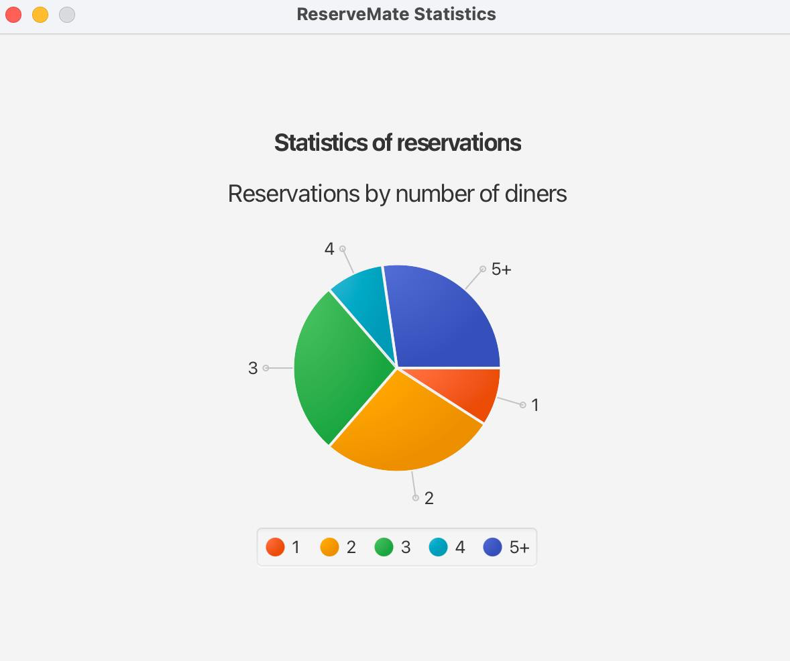

# User Guide

ReserveMate is a **desktop application for managing reservations, optimized for use via a  Line Interface** (CLI) while still having the benefits of a Graphical User Interface (GUI). If you can type fast, ReserveMate can get your reservation management tasks done faster than traditional GUI apps.

<!-- * Table of Contents -->
<page-nav-print />

--------------------------------------------------------------------------------------------------------------------

## Quick start

1. Ensure you have Java `17` or above installed in your Computer.<br>
   **Mac users:** Ensure you have the precise JDK version prescribed [here](https://se-education.org/guides/tutorials/javaInstallationMac.html).

2. Download the latest `.jar` file from [here](https://github.com/AY2425S2-CS2103-F08-1/tp/releases).

3. Copy the file to the folder you want to use as the _home folder_ for your ReserveMate

4. Open a command terminal, `cd` into the folder you put the jar file in, and use the `java -jar reservemate.jar` command to run the application.<br>
   A GUI similar to the below should appear in a few seconds. Note how the app contains some sample data. <br>

[//]: # (   ![Ui]&#40;images/UI.png&#41;)

[//]: # (5. Type the command in the command box and press `Enter` to execute it. e.g. typing **`help`** and pressing `Enter` will list all available commands.<br>)

[//]: # (   )
[//]: # (6. Refer to the [Features]&#40;#features&#41; below for details of each command.)

### GUI Overview

ReserveMate GUI is organized into three parts.


- `Command Box`: This is where users enter commands to interact with ReserveMate.
- `Reservation List`: Displays a list of all current reservations.
- `Result Display`: Shows output messages in response to user commands, such as confirmations, error messages or summaries of the executed commands.

### Command Structure

Understanding how commands work in ReserveMate is important for using the app effectively. This section breaks down the **structure, arguments, and parameters** used across all commands.

Commands in ReserveMate have the following structure:

<p style="text-align: center;">
    <code>command_word (REFERENCE) (PARAMETERS)</code>
</p>
<br>

| command_word                                                   | REFERENCE                                                 | PARAMETERS                                                       |
|----------------------------------------------------------------|-----------------------------------------------------------|----------------------------------------------------------------|
| The command to be performed. Command words are **case-sensitive**. | Often used to reference an index in the reservation list. | Used to specify additional details for a given `command_word`. |

#### Reference Types

| Reference             | Meaning                                  | Constraints                                                                         | Remarks                                                                      |
|-----------------------|------------------------------------------|-------------------------------------------------------------------------------------|------------------------------------------------------------------------------|
| `INDEX`<sup>1,2</sup> | Index of reservation in reservation list | Must be a positive integer `>= 1` | Used in commands like `edit` and `delete` to refer to a specific reservation |

**Notes:**

1. `INDEX` is **one-based** (i.e. starts from 1 not 0) and must fall within the range of the current reservation list.
2. ReserveMate handles `INDEX` errors in two ways:
   1. If the index is an invalid number (e.g. non-positive integer, non-integer or exceeds `Integer.MAX_VALUE`), it is treated as an invalid command format.
   2. If the index is a valid positive integer but exceeds the size of the current reservation list, it is treated as an invalid index. Only values within the range `[1, reservation list size]` are supported.

#### Prefixes

Prefixes are in the format:

<p style="text-align: center;">
    <code>prefix/Value</code>
</p>

---
They come in several variations, based on whether they are **mandatory**, **optional**, or **repeatable** (variadic):

|                          | **Mandatory**        | **Optional<sup>1</sup>**     |
|--------------------------|----------------------|-------------------------------|
| **Not variadic**         | `prefix/Value`       | `[prefix/Value]`              |
| **Variadic<sup>2</sup>** | `prefix/Value...`    | `[prefix/Value]...`           |
---

**Notes:**

1. **Optional prefixes** can be omitted, and the command will still execute successfully _(assuming all required parts of hte command are provided and correctly formatted)_.
2. **Variadic prefixes** allow you to provide **multiple values** for the same field in a single command by repeating the prefix with different values.
  For example:
   - `o/Birthday o/Anniversary` → Valid (multiple occasions)

#### Prefix Types

The prefixes used in ReserveMate are universal across all commands.

| Prefix | Description             | Constraints                                                                                                                                                                                                                                                                                                                                                              | Valid                                      | Invalid                                       |
|--------|-------------------------|--------------------------------------------------------------------------------------------------------------------------------------------------------------------------------------------------------------------------------------------------------------------------------------------------------------------------------------------------------------------------|--------------------------------------------|-----------------------------------------------|
| `n/`   | Customer Name           | 2–50 characters, only `alphanumeric` characters and `spaces`. Case-insensitive.                                                                                                                                                                                                                                                                                          | `n/John Doe`, `n/Mary-Anne`, `n/Bobby Tan` | `n/J0hn`, `n/`, `n/@John`                     |
| `p/`   | Contact Number          | Exactly 8 digits and must start with `8` or `9`.                                                                                                                                                                                                                                                                                                                         | `p/91234567`, `p/87654321`                 | `p/1234567`, `p/01234567`, `p/`               |
| `e/`   | Email Address           | Must be a valid email format of `local-part@domain`. The local-part should only contain `alphanumeric` characters and these special characters, excluding the parentheses, `(+_.-)`. The local-part cannot start or end with any special characters. This is followed by a `@` and then a domain name. The domain name is made up of domain labels separated by periods. | `e/john@example.com`                       | `e/`, `e/john@.com`                           |
| `x/`   | Number of Diners        | Integer from 1 to 10 inclusive.                                                                                                                                                                                                                                                                                                                                          | `x/1`, `x/5`, `x/10`                       | `x/0`, `x/11`, `x/-2`, `x/ten`                |
| `d/`   | Reservation Date & Time | Format: `YYYY-MM-DD HHmm`. Must be within next 60 days.                                                                                                                                                                                                                                                                                                                  | `d/2025-05-11 1800`, `d/2025-04-30 1000`   | `d/2023-02-21`, `d/2028-02-21 0900`, `d/past` |
| `sd/`  | Start Date (Filter)     | Format: `YYYY-MM-DD HHmm`. Must be earlier than `ed/`.                                                                                                                                                                                                                                                                                                                   | `sd/2025-05-01 1800`                       | `sd/2025-13-01`, `sd/invalid`, `sd/`          |
| `ed/`  | End Date (Filter)       | Format: `YYYY-MM-DD HHmm`. Must be later than `sd/`.                                                                                                                                                                                                                                                                                                                     | `ed/2025-05-15 2200`                       | `ed/2025-01-01`, `ed/late`, `ed/`             |
| `o/`   | Occasion                | 2–50 characters, only `Alphanumeric` and is `variadic`. It is optional.                                                                                                                                                                                                                                                                                                  | `o/Birthday`, `o/Anniversary o/VIP`        | `o/`, `o/@celebration`                        |

**Notes:**

1. Prefixes are case-insensitive: `n/John` is the same as `N/John`.
2. Prefix order does not matter in commands.
3. Optional prefixes may be omitted entirely.
4. Variadic prefixes (like `o/`) can appear multiple times in a command.
5. Blank values (e.g., `n/`, `p/`) are invalid and will return an invalid format error.


### Remarks


---

#### `n/` — Customer Name

- Names are **space-sensitive**:
  `n/AlexYeoh`, `n/Alex Yeoh`, and `n/Alex  Yeoh` are treated as different names.

- Names are **case-insensitive**:
  `n/alex yeoh` is the same as `n/AlEx YeOh`.

- Names with **excessive leading/trailing spaces** are trimmed:
  `n/   Alice Johnson   ` → `n/Alice Johnson`

- 2 to 50 characters inclusive.

- Names should contain only characters and spaces

- Names can be:
    - A **single character or initial** (e.g., `n/A`) — valid but potentially confusing in lists.

---

#### `p/` — Contact Number

- Phone numbers **must start with `8` or `9`** and be exactly 8 digits long.
- Multiple reservations can share the **same phone number** and **different date-time** — duplicates allowed.

---

#### `e/` — Email Address

- Emails must match a **basic regex pattern**, but:
    - Technically valid emails may be **functionally incorrect** (e.g., `123@123`).
    - Strange but valid domains (e.g., `user@x-y.com`, `a@123.co`) are allowed.
    - Multiple reservations can share the **same email** and **different date-time** — duplicates allowed.

---

#### `x/` — Number of Diners

- Accepts integers from **1 to 10**, inclusive.
- Non-integer or out-of-range values (e.g., `x/0`, `x/15`) are rejected.
- `x/0` or `x/one` → invalid input.

---

#### `d/` — Reservation Date & Time

- Format: `YYYY-MM-DD HHmm`
- Date must be:
    - Within the next **60 days**
    - Cannot be a past date-time
    - Time must be in hourly increments, ending with `00` (e.g., `1400`).

---

#### `o/` — Occasion

- Prefix is **optional and variadic** (can appear multiple times).
- Accepts alphanumeric values and basic punctuation.
- Blank values (e.g., `o/`) will clear the occasions for the specific reservation when used in `edit` command it will
result in an error when used in `add` command
- No enforcement of case — `o/birthday` and `o/Birthday` are treated the same.

---

#### `sd/` and `ed/` — Start and End Date for Filtering

- Format: `YYYY-MM-DD HHmm`
- `sd/` must be **before** `ed/`
- If both are valid but incorrectly ordered, an error is thrown.
- Time must be in hourly increments, ending with `00` (e.g., `1400`).

---

To get started with ReserveMate, type the command in the command box and press `Enter` to execute it.

--------------------------------------------------------------------------------------------------------------------

## Features

<box type="info" seamless>

**Notes about the command format:**<br>

* Words in `<UPPER_CASE>` are mandatory parameters to be supplied by the user.<br>
  e.g. in `add n/NAME`, `NAME` is a parameter which can be used as `add n/John Doe`.

* Words in `[UPPER_CASE]` are optional parameters to be supplied by the user.<br>
  e.g. in `edit <INDEX> p/96214711`, `PHONE_NUMBER` is a parameter which can be used as `add n/John Doe p/96214711`.

* Items in square brackets are optional.<br>
  e.g. `edit <INDEX> [o/OCCASION]` can be used as `n/John Doe o/Birthday` or as `n/John Doe`.

* Items with `…` are variadic, meaning they can be used zero or more times.<br>
  e.g. `[o/OCCASION]…​` can be used as ` ` (i.e. 0 times), `o/Birthday`, `o/Birthday o/Graduation` etc.

* Prefix order does not matter. <br>
  e.g. if the command specifies `n/NAME p/PHONE_NUMBER`, `p/PHONE_NUMBER n/NAME` is also acceptable.

* Extraneous parameters for commands that do not take in parameters (such as `help`, `list`, `exit` and `clear`) will be invalid.<br>
  e.g. if the command specifies `help 123`, it will be interpreted as invalid.

* All commands are case-insensitive.
  e.g. if the command specifies `list` or `LIST` will be accepted as valid commands.

* If you are using a PDF version of this document, be careful when copying and pasting commands that span multiple lines as space characters surrounding line-breaks may be omitted when copied over to the application.
</box>

### Viewing User Guide : `User Guide`

Refers user to GitHub ReserveMate user guide documentation.


### Adding a reservation: `add`

Adds a new `Reservation` to ReserveMate.

Format: `add n/NAME p/PHONE_NUMBER e/EMAIL x/NUMBER_OF_DINER d/DATE_TIME [o/OCCASION]…`

**Constraints**
* A reservation can have any number of occasion (including 0)
* Phone number should start with either 8 or 9 and must be 8 digits.
* Date time should be after current time but within 60 days from it.

- **Successful Execution:**
> ---
>
> **Use Case #1**: Adding a reservation under `John Doe` with phone number `98765432`, email `johnd@example.com`, diner size of `5` on `2025-04-12 1800` for a `birthday`.
>
> **Input**: `add n/John Doe p/98765432 e/johnd@example.com x/5 d/2025-04-12 1800 o/BIRTHDAY`
>
> **Output**: <br>
> ```
> New reservation added: John Doe; Phone: 98765432; Email: johnd@example.com; Number of Diners: 5; Occasion: [BIRTHDAY]
>```
> ---
>
> **Use Case #2**: Adding a reservation under `Jane Doe` with phone number `81234567`, email `betsycrowe@example.com`, diner size of `3` on `2025-04-20 1800` for a `graduation`.
>
> **Input**: `add n/Jane Doe e/betsycrowe@example.com x/3 p/81234567 o/GRADUATION d/2025-04-20 1800`
>
> **Output**: <br>
> ```
> New reservation added: Jane Doe; Phone: 81234567; Email: betsycrowe@example.com; Number of Diners: 3; Occasion: [GRADUATION]
> ```

- **Failed Execution:**
> ---
>
> **User Error #1**: Missing `NAME` field
>
> **Input**: `add p/93828282 e/johnd@example.com x/5 d/2026-12-31 1800`
>
> **Output**: <br>
> ```
> Invalid command format!
> add: Adds a reservation to the reservation book. Parameters: n/NAME p/PHONE e/EMAIL x/NUMBER OF DINERS d/DATETIME [o/OCCASION]... <br>
> Example: add n/John Doe p/98765432 e/johnd@example.com x/5 d/2026-12-31 1800 o/Birthday
> ```
>
> ---
>
> **User Error #2**: Missing `PHONE` field
>
> **Input**: `add n/John Doe e/johnd@example.com x/5 d/2026-12-31 1800 o/Birthday`
>
> **Output**: <br>
> ```
> Invalid command format!
> add: Adds a reservation to the reservation book. Parameters: n/NAME p/PHONE e/EMAIL x/NUMBER OF DINERS d/DATETIME [o/OCCASION]... <br>
> Example: add n/John Doe p/98765432 e/johnd@example.com x/5 d/2026-12-31 1800 o/Birthday
> ```
>
> ---
>
> **User Error #3**: Missing `DINER SIZE` field
>
> **Input**: `add n/John Doe p/98765432 e/johnd@example.com d/2026-12-31 1800 o/Birthday`
>
> **Output**: <br>
> ```
> Invalid command format!
> add: Adds a reservation to the reservation book. Parameters: n/NAME p/PHONE e/EMAIL x/NUMBER OF DINERS d/DATETIME [o/OCCASION]... <br>
> Example: add n/John Doe p/98765432 e/johnd@example.com x/5 d/2026-12-31 1800 o/Birthday
> ```
>
> ---
>
> **User Error #4**: Missing `DATE` field
>
> **Input**: `add n/John Doe p/98765432 x/5 o/Birthday`
>
> **Output**: <br>
> ```
> Invalid command format!
> add: Adds a reservation to the reservation book. Parameters: n/NAME p/PHONE e/EMAIL x/NUMBER OF DINERS d/DATETIME [o/OCCASION]... <br>
> Example: add n/John Doe p/98765432 e/johnd@example.com x/5 d/2026-12-31 1800 o/Birthday
> ```
>
> ---
>
> **User Error #5**: Reservation already exists (duplicates)
>
> **Input**: `add n/John Doe p/98765432 e/johnd@example.com x/5 d/2025-04-12 1800 o/BIRTHDAY`
>
> **Output**:
> ```A reservation already exists for this customer (same email or phone) at the chosen date-time.```
>
> ---
---

### Editing a reservation : `edit`

Edits an existing `Reservation` in ReserveMate.

Format: `edit INDEX [n/NAME] [p/PHONE] [e/EMAIL] [d/DATE_TIME] [x/NUMBER_OF_DINERS] [o/OCCASION]…`

**Constraints**
* `INDEX` **must be a positive integer** referring to a valid reservation in the list.
* At least one of field (prefix) must be provided.
* Editing occasion replaces the existing list of occasions. Use `o/` with no value to clear.
* Dates must be within 60 days from now and in the future.

- **Successful Execution:**
> ---
>
> **Use Case #1**: Edit phone and email of reservation at index `1`.
>
> **Input:**
> `edit 1 p/91234567 e/johndoe@example.com`
>
> **Output:**
> ```
> Edited Reservation: John Doe; Phone: 91234567; Email: johndoe@example.com; Number of Diners: 5; Occasion: [BIRTHDAY]
> ```
>
> ---
>
> **Use Case #2**: Edit name and clear all occasions for reservation at index `2`.
>
> **Input:**
> `edit 2 n/Brittany o/`
>
> **Output:**
> ```
> Edited Reservation: Brittany; Phone: 91236474; Email: johnny@example.com; Number of Diners: 1; Occasion:
> ```
>
> ---
>
> **Use Case #3**: Edit date and number of diners for reservation at index `3`.
>
> **Input:**
> `edit 3 d/2025-04-25 2000 x/6`
>
> **Output:**
> ```
> Edited Reservation: Jane Doe; Phone: 81234567; Email: betsycrowe@example.com; Number of Diners: 6; Occasion: [GRADUATION]
> ```
>
> ---

---

- **Failed Execution:**
> ---
>
> **User Error #1**: No fields provided to edit.
>
> **Input:**
> `edit 1`
>
> **Output:**
> ```
> At least one field to edit must be provided.
> ```
>
> ---
>
> **User Error #2**: Invalid index (0).
>
> **Input:**
> `edit 0 p/91234567`
>
> **Output:**
> ```
> The reservation index provided is invalid
> ```
>
> ---
>
> **User Error #3**: Reservation index does not exist.
>
> **Input:**
> `edit 99 n/Alex`
> _(Assuming only 5 reservations exist)_
>
> **Output:**
> ```
> The reservation index provided is invalid
> ```
>
> ---
>
> **User Error #4**: Editing with invalid phone number.
>
> **Input:**
> `edit 1 p/12345678`
>
> **Output:**
> ```
> Phone numbers should only contain numbers, it should begins with either 8 or 9 and it must be exactly 8 digits long
> ```
>
> ---
>
> **User Error #5**: Editing with past date.
>
> **Input:**
> `edit 2 d/2023-01-01 1200`
>
> **Output:**
> ```
> DateTime must be in the format YYYY-MM-DD HHmm and be a date-time after the current time but within 60 days from now.
> ```
>
> ---

### Deleting a reservation : `delete`

Deletes the specified `Reservation` from ReserveMate.

Format: `delete <INDEX> cfm`

**Constraints**
* `INDEX` **must be a positive integer** referring to a valid reservation in the list.
* A confirmation flag 'cfm' is **required** **and case-sensitive**

---

- **Successful Execution:**
> ---
>
> **Use Case #1**: Deleting the 2nd reservation after listing all.
>
> **Input:**
> `list`
> `delete 2 cfm`
>
> **Output:**
> ```
> Reservation 2 deleted successfully
> ```
>
> ---
>
> **Use Case #2**: Deleting a reservation found through a filtered list.
>
> **Input:**
> `find Jane`
> `delete 1 cfm`
>
> **Output:**
> ```
> Reservation 1 deleted successfully
> ```
>
> ---

---

- **Failed Execution:**
> ---
>
> **User Error #1**: Missing confirmation flag.
>
> **Input:**
> `delete 1`
>
> **Output:**
> ```
> Are you sure you want to delete 1? Type 'delete 1 cfm'
> ```
>
> ---
>
> **User Error #2**: Invalid index (zero).
>
> **Input:**
> `delete 0 cfm`
>
> **Output:**
> ```
> Invalid command format!
> delete: Deletes the reservation identified by the index number used in the reservation list.
> Parameters: INDEX (must be a positive integer)
> Example: delete 1 cfm
> ```
>
> ---
>
> **User Error #3**: Index out of bounds.
>
> **Input:**
> `delete 10 cfm`
> _(Assuming only 3 reservations exist)_
>
> **Output:**
> ```
> The reservation index provided is invalid
> ```
>
> ---
>
> **User Error #4**: Confirmation flag misspelled.
>
> **Input:**
> `delete 1 confirm`
>
> **Output:**
> ```
> Are you sure you want to delete 1? Type 'delete 1 cfm'
> ```
>
> ---

### Managing reservation preferences : `pref`

Saves a `Reservation` preference in ReserveMate.

Format:
* To save a preference: `pref save <INDEX> <PREFERENCE_DESCRIPTION>`

**Notes**:
* `INDEX` **must be a positive integer** referring to a valid reservation in the list.
* `PREFERENCE_DESCRIPTION` can contain spaces and must be alphanumeric (E.g. include dietary needs, seating preferences, or other customer requests).
* Showing a preference will indicate `None` if it has not been set.

---

- **Successful Execution:**
> ---
>
> **Use Case #1**: Saving a preference for Reservation 1.
>
> **Input:**
> `pref save 1 Window seat preferred, allergic to nuts`
>
> **Output:**
> ```
> Saved preference for reservation: 1
> ```
>
> ---
---

- **Failed Execution:**
> ---
>
> **User Error #1**: Saving without providing a preference description.
>
> **Input:**
> `pref save 2`
>
> **Output:**
> ```
>Invalid command format!
>pref: Saves customer preferences for the reservation identified by the index number.

>Parameters for saving: pref save <INDEX> <PREFERENCE>

>Ensure all parameters are entered and valid
>Example: pref save 1 No nuts, allergic to seafood
> ```
>
> ---
>
> **User Error #2**: Missing or invalid index in `save`.
>
> **Input:**
> `pref save -10`
>
> **Output:**
> ```
> The reservation index must be a non-negative integer greater than 0!
> ```
>
> ---
>
> **User Error #3**: Invalid sub-command.
>
> **Input:**
> `pref update 1 Vegan menu`
>
> **Output:**
> ```
>Invalid command format!
>pref: Saves customer preferences for the reservation identified by the index number.

>Parameters for saving: pref save <INDEX> <PREFERENCE>

>Ensure all parameters are entered and valid
>Example: pref save 1 No nuts, allergic to seafood
> ```
>
> ---

### Listing all reservations : `list`

Shows a list of all `Reservation` in the ReserveMate.

Format: `list`

---

- **Successful Execution:**
> ---
>
> **Use Case #1**: Listing all reservations in the system.
>
> **Input:**
> `list`
>
> **Output:**
> ```
> Listed all reservations
> 1. John Doe (5 diners) - 2025-04-12 1800
> 2. Jane Doe (3 diners) - 2025-04-20 1800
> 3. Bobby (1 diner) - 2025-04-18 1900
> ```
>
> ---
>
> **Use Case #2**: Listing when no reservations exist.
>
> **Input:**
> `list`
>
> **Output:**
> ```
> No reservations found. Use the 'add' command to create a reservation
> or 'help' to view all commands.
> ```
>
> ---

---

- **Failed Execution:**
> ---
>
> **User Error #1**: Providing unnecessary arguments.
>
> **Input:**
> `list all`
>
> **Output:**
> ```
> Invalid command.
> ```
>
> ---
>
> **User Error #2**: Accidental typo.
>
> **Input:**
> `lst`
>
> **Output:**
> ```
> Unknown command
> ```
>
> ---`

### Showing reservation details : `show`

Show additional details of a specific `Reservation`.

Format: `show <INDEX>`

**Constraints**:
* `INDEX` **must be a positive integer** referring to a valid reservation in the list.

---

- **Successful Execution:**
> ---
>
> **Use Case #1**: Viewing the details of the first reservation in the list.
>
> **Input:**
> `show 1`
>
> **Output:**
> ```
> Details of Reservation: John Doe; Phone: 98765432; Email: johnd@example.com; Number of Diners: 5; Occasion: [BIRTHDAY]
> ```
>
> ---
>
> **Use Case #2**: Showing reservation details without any occasion.
>
> **Input:**
> `show 2`
>
> **Output:**
> ```
> Details of Reservation: Jane Doe; Phone: 81234567; Email: betsycrowe@example.com; Number of Diners: 3; Occasion:
> ```
>
> ---

---

- **Failed Execution:**
> ---
>
> **User Error #1**: Providing an index of 0.
>
> **Input:**
> `show 0`
>
> **Output:**
> ```
> The reservation index provided is invalid
> ```
>
> ---
>
> **User Error #2**: Providing an index larger than the list size.
>
> **Input:**
> `show 10`
> _(Assuming only 3 reservations exist)_
>
> **Output:**
> ```
> The reservation index provided is invalid
> ```
>
> ---
>
> **User Error #3**: Omitting the index.
>
> **Input:**
> `show`
>
> **Output:**
> ```
> Invalid command format!
> show: Shows the reservation details identified by the index number used in the displayed reservation list.
> Parameters: INDEX (must be a positive integer)
> Example: show 1
> ```
>
> ---
>
> **User Error #4**: Inputting a non-numeric index.
>
> **Input:**
> `show first`
>
> **Output:**
> ```
> Invalid command format!
> show: Shows the reservation details identified by the index number used in the displayed reservation list.
> Parameters: INDEX (must be a positive integer)
> Example: show 1
> ```
>
> ---

### Locating reservations by name: `find`

Finds `Reservation` whose names contain any of the given keywords.

Format: `find KEYWORD [MORE_KEYWORDS]`

**Constraints**
- The search is **case-insensitive**.
- The order of keywords does **not** matter.
- Only **full words** will be matched (e.g., `Han` will not match `Hans`).
- Searches are done on the **name field only**.
- Matches are based on **OR** logic (any one keyword match is sufficient).

---

- **Successful Execution:**
> ---
>
> **Use Case #1**: Finding a reservation by full name.
>
> **Input:**
> `find John`
>
> **Output:**
> ```
> 1 reservations listed!
> 1. John Doe (5 diners) - 2025-04-12 1800
> ```
>
> ---
>
> **Use Case #2**: Finding multiple matches with multiple keywords.
>
> **Input:**
> `find john jane`
>
> **Output:**
> ```
> 2 reservations listed!
> 1. John Doe (5 diners) - 2025-04-12 1800
> 2. Jane Doe (3 diners) - 2025-04-20 1800
> ```
>
> ---
>
> **Use Case #3**: Case-insensitive match.
>
> **Input:**
> `find john`
>
> **Output:**
> ```
> 1 reservations listed!
> 1. John Doe (5 diners) - 2025-04-12 1800
> ```
>
> ---

---

- **Failed Execution:**
> ---
>
> **User Error #1**: No keyword provided.
>
> **Input:**
> `find`
>
> **Output:**
> ```
> Invalid command format!
> find: Finds all reservations whose names contain any of the specified keywords (case-insensitive) and displays them as a list with index numbers.
> Parameters: KEYWORD [MORE_KEYWORDS]...
> Example: find alice bob charlie
> ```
>
> ---
>
> **User Error #2**: Keywords do not match any reservations.
>
> **Input:**
> `find Michael`
>
> **Output:**
> ```
> No reservations found matching the keyword(s).
> ```
>
> ---
>
> **User Error #3**: Partial word search.
>
> **Input:**
> `find Han`
> _(Assuming only `Hans` exists)_
>
> **Output:**
> ```
> No reservations found matching the keyword(s).
> ```
>
> ---

### Filtering the reservations: `filter`

Filters `Reservation` between the specified date and time range.

Format: `filter sd/ DATE_TIME ed/ DATE_TIME`

**Constraints**
- Filters all reservations between the given `DATE_TIME`, inclusive of the `DATE_TIME` provided.
-`DATE_TIME` provided must be valid and follow the format: `YYYY-MM-DD HHmm`.
- The `DATE_TIME` provided for `sd/` must be before the date and time provided for `ed/`

---

- **Successful Execution:**
> ---
>
> **Use Case #1**: Filtering reservations from `2025-04-12 1400` to `2025-05-15 1400`.
>
> **Input:**
> `filter sd/ 2025-04-12 1400 ed/ 2025-05-15 1400`
>
> **Output:**
> ```
> Here are the available reservations for the date range.
> 1. John Doe (5 diners) - 2025-04-12 1800
> 2. Jane Doe (3 diners) - 2025-04-20 1800
> ```
>
> ---
>
> **Use Case #2**: No reservations in the given range.
>
> **Input:**
> `filter sd/ 2026-12-20 1200 ed/ 2026-12-22 1200`
>
> **Output:**
> ```
> No reservations found for the date range.
> ```
>
> ---

---

- **Failed Execution:**
> ---
>
> **User Error #1**: Start date is after end date.
>
> **Input:**
> `filter sd/ 2025-05-20 1400 ed/ 2025-04-18 1400`
>
> **Output:**
> ```
> Start date must be before end date
> ```
>
> ---
>
> **User Error #2**: Invalid date format.
>
> **Input:**
> `filter sd/ 2026/12/12 1400 ed/ 2026-12-15 1400`
>
> **Output:**
> ```
> DateTime must be in the format YYYY-MM-DD HHmm
> ```
>
> ---
>
> **User Error #3**: Missing one or both parameters.
>
> **Input:**
> `filter sd/ 2026-12-12 1400`
>
> **Output:**
> ```
> Invalid command format!
> filter: Filters all reservations made between the given date range.
> Parameters: sd/START DATE ed/END DATE
> Example: filter sd/ 2026-12-31 1800 ed/ 2026-12-31 1900
> ```
>
> ---

### Free reservations: `free`

Displays all available `Reservation` time slots in user specified day.

Format: `free <DATE>`

---

- **Successful Execution:**
> ---
>
> **Use Case #1**: Viewing available slots.
>
> **Input:**
> `free d/2025-04-28`
>
> **Output:**
> ```
> Available free time slots:
> - 2025-04-28 1600 to 2025-04-28 1700
> - 2025-04-28 2000 to 2025-04-28 2100
> ```
>
> ---

---

- **Failed Execution:**
> ---
>
> **User Error #1**: Missing date.
>
> **Input:**
> `free`
>
> **Output:**
> ```
> Invalid command format!
> free: Find all free time slots in a given day
> 
> Parameters: d/DATE
> 
> Example: free d/2025-05-01
> ```
>
> ---
>
> **User Error #2**: Typo in command.
>
> **Input:**
> `freeslot`
>
> **Output:**
> ```
> Invalid command format! 
> help: Shows program usage instructions.
> Example: help
> ```
>
> ---
> > **User Error #3**: Invalid date format.
>
> **Input:**
> `free d/04-28-2025`
>
> **Output:**
> ```
> Date must be in the format YYYY-MM-DD and adhere to the following constraints:
> 1. The date must be a valid calendar date.
> 2. The date must be after the current date but within 60 days from now.
> ```
>
> ---

### Display reservation statistics : `stats`

Displays statistics of `Reservation` in ReserveMate.

Format: `stats`

---

- **Successful Execution:**
> ---
>
> **Use Case #1**: Generating statistics when reservations exist.
>
> **Input:**
> `stats`
>
> **Output:**
> *(Pie chart appears showing distribution of number of reservations by diner size.)*
>
> 
>
> ---

---

- **Failed Execution:**
> ---
>
> **User Error #1**: Command used when no reservations exist.
>
> **Input:**
> `stats`
>
> **Output:**
> ```
> No reservation data available to generate statistics. Please add reservations first.
> ```
>
> ---
>
> **User Error #2**: Command typed with extra argument.
>
> **Input:**
> `stats now`
>
> **Output:**
> ```
> Invalid command.
> ```
>
> ---

### Clearing all entries : `clear`

Clears all `Reservation` from the ReserveMate.

Format: `clear cfm`

**Constraints**
- The confirmation flag `cfm` is **mandatory** and **case-sensitive**.
- This action **cannot be undone**.
- Used with caution to reset the reservation list completely.


---

- **Successful Execution:**
> ---
>
> **Use Case #1**: Clearing all reservations with confirmation.
>
> **Input:**
> `clear cfm`
>
> **Output:**
> ```
> Reservation book has been cleared!
> ```
>
> ---

---

- **Failed Execution:**
> ---
>
> **User Error #1**: Missing confirmation flag.
>
> **Input:**
> `clear`
>
> **Output:**
> ```
> Clear command requires confirmation.
> Please enter: clear cfm
> ```
>
> ---
>
> **User Error #2**: Typo in confirmation flag.
>
> **Input:**
> `clear confirm`
>
> **Output:**
> ```
> Invalid command format!
> clear: Clears the reservation in the reservation list.
> Example: clear cfm
> ```
>
> ---
>
> **User Error #3**: Command issued when list is already empty.
>
> **Input:**
> `clear cfm`
>
> **Output:**
> ```
> Reservation List is empty. No reservations found to clear!
> ```
>
> ---

### Displaying commands : `help`

Displays a list of available commands.

Format: `help`

---

- **Successful Execution:**
> ---
>
> **Use Case #1**: Displaying the help window.
>
> **Input:**
> `help`
>
> **Output:**
> ```
> List of Commands:
> 1. add - Enter a reservation
> 2. edit - Edit a reservation
> 3. delete - Delete a reservation
> 4. pref - Saves or displays a reservation preference
> 5. list - Displays a list of all reservations
> 6. show - Displays reservation details
> 7. find - Finds a reservation by name
> 8. filter - Filters reservations by the specified data and time range
> 9. free - Displays all available time slots within the next 60 days
> 10. stats - Displays reservation statistics
> 11. clear - Deletes all reservations
> 12. help - Displays a list of available commands
> 13. exit - Exit the program
> ```

---

- **Failed Execution:**
> ---
>
> **User Error #1**: Command typed with extra arguments.
>
> **Input:**
> `help now`
>
> **Output:**
> ```
> Invalid command.
> ```
>
> ---
>
> **User Error #2**: Misspelled command.
>
> **Input:**
> `halp`
>
> **Output:**
> ```
> Unknown command
> ```
>
> ---

### Exiting the program : `exit`

Exits the program.

Format: `exit`

### Saving the data

ReserveMate data are saved in the hard disk automatically after any command that changes the data. There is no need to save manually.

### Editing the data file

ReserveMate data are saved automatically as a JSON file `[JAR file location]/data/reservemate.json`. Advanced users are welcome to update data directly by editing that data file.

<box type="warning" seamless>

**Caution:**
If your changes to the data file makes its format invalid, ReserveMate will discard all data and start with an empty data file at the next run.  Hence, it is recommended to take a backup of the file before editing it.<br>
Furthermore, certain edits can cause the ReserveMate to behave in unexpected ways (e.g., if a value entered is outside the acceptable range). Therefore, edit the data file only if you are confident that you can update it correctly.
</box>

### Archiving data files `[coming in v2.0]`

_Details coming soon ..._

--------------------------------------------------------------------------------------------------------------------

## FAQ

**Q**: How do I transfer my data to another Computer?<br>
**A**: Install the app in the other computer and overwrite the empty data file it creates with the file that contains the data of your previous ReserveMate home folder.

--------------------------------------------------------------------------------------------------------------------

## Known issues

1. **When using multiple screens**, if you move the application to a secondary screen, and later switch to using only the primary screen, the GUI will open off-screen. The remedy is to delete the `preferences.json` file created by the application before running the application again.
2. **If you minimize the Help Window** and then run the `help` command (or use the `Help` menu, or the keyboard shortcut `F1`) again, the original Help Window will remain minimized, and no new Help Window will appear. The remedy is to manually restore the minimized Help Window.

--------------------------------------------------------------------------------------------------------------------

## Command summary

| Action         | Format, Examples                                                                                                                                                           |
|----------------|----------------------------------------------------------------------------------------------------------------------------------------------------------------------------|
| **Add**        | `add n/NAME p/PHONE_NUMBER e/EMAIL x/NUMBER_OF_DINER d/DATE_TIME [o/OCCASION]…​`<br>e.g., `add n/John Doe p/98765432 e/johnd@example.com x/5 d/2025-04-16 1800 o/Birthday` |
| **Edit**       | `edit INDEX [n/NAME] [p/PHONE_NUMBER] [e/EMAIL] [x/NUMBER_OF_DINERS] [d/DATE_TIME] [o/OCCASION]…​`<br>e.g., `edit 2 n/James Lee e/jameslee@example.com`                    |
| **Delete**     | `delete INDEX cfm`<br>e.g., `delete 3 cfm`                                                                                                                                 |
| **Preference** | `pref save INDEX PREFERENCE_TEXT`<br>e.g., `pref save 1 Window seat preferred`                                                                                             |
| **List**       | `list`<br>e.g., `list`                                                                                                                                                     |
| **Show**       | `show INDEX`<br>e.g., `show 2`                                                                                                                                             |
| **Find**       | `find NAME [MORE_NAMES]`<br>e.g., `find James Jake`                                                                                                                        |
| **Filter**     | `filter sd/DATE_TIME ed/DATE_TIME`<br>e.g., `filter sd/2026-12-12 1400 ed/2026-12-14 1400`                                                                                 |
| **Free**       | `free`<br>e.g., `free`                                                                                                                                                     |
| **Stats**      | `stats`<br>e.g., `stats`                                                                                                                                                   |
| **Clear**      | `clear cfm`<br>e.g., `clear cfm`                                                                                                                                           |
| **Help**       | `help`<br>e.g., `help`                                                                                                                                                     |
| **Exit**       | `exit`<br>e.g., `exit`                                                                                                                                                     |
