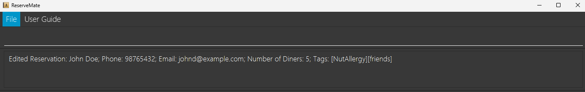
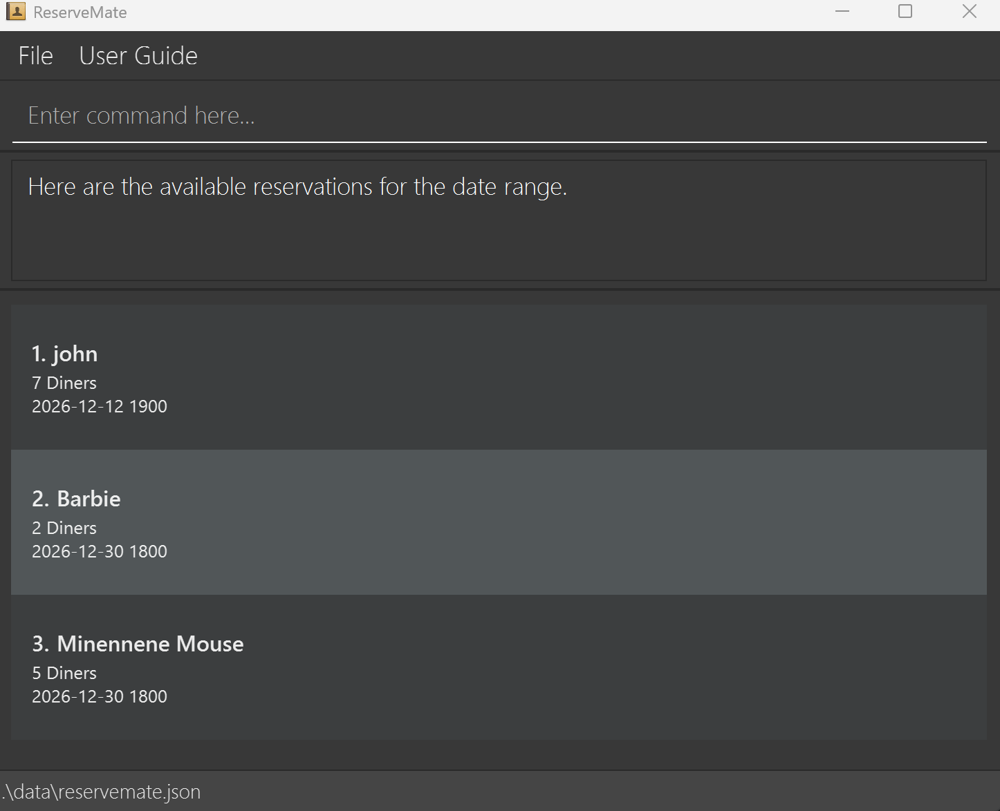

# User Guide

ReserveMate is a **desktop app for managing reservations, optimized for use via a  Line Interface** (CLI) while still having the benefits of a Graphical User Interface (GUI). If you can type fast, ReserveMate can get your reservation management tasks done faster than traditional GUI apps.

<!-- * Table of Contents -->
<page-nav-print />

--------------------------------------------------------------------------------------------------------------------

## Quick start

1. Ensure you have Java `17` or above installed in your Computer. 
   **Mac users:** Ensure you have the precise JDK version prescribed [here](https://se-education.org/guides/tutorials/javaInstallationMac.html).

2. Download the latest `.jar` file from [here](https://github.com/AY2425S2-CS2103-F08-1/tp/releases).

3. Copy the file to the folder you want to use as the _home folder_ for your ReserveMate

4. Open a command terminal, `cd` into the folder you put the jar file in, and use the `java -jar reservemate.jar` command to run the application. 
   A GUI similar to the below should appear in a few seconds. Note how the app contains some sample data. 
   

5. Type the command in the command box and press Enter to execute it. e.g. typing **`help`** and pressing Enter will list all available commands. 
   Some example commands you can try:

   * `add n/John Doe p/98765432 e/johnd@example.com x/5 d/2026-12-12 1800 o/Birthday` : Adds a reservation named `John Doe` to the ReserveMate.

   * `edit 2 n/Bobby p/98765432 e/bobby@example.com` : Updates the 2nd reservation shown in the reservation list to reflect new details of at least one specified tag.

   * `pref save 3 Allergic to seafood` : saves the 3rd reservation's preference in the reservation list.

   * `pref show 3 ` : Displays the 3rd reservation's preference that is stored in the reservation list.

   * `delete 3` : Deletes the 3rd reservation shown in the reservation list.

   * `show 1` : Displays additional details about the 1st reservation shown in the reservation list.

   * `list` : Lists all reservations.

   * `help` : Displays all available commands.

   * `find john` : Filters & displays reservations containing "john".

   * `clear` : Deletes all reservations.
   
   * `filter sd/ 2026-12-12 1800 ed/ 2026-12-15 1400` : Filters all reservations between the 2 dates.
   
   * `exit` : Exits the app.

6. Refer to the [Features](#features) below for details of each command.

--------------------------------------------------------------------------------------------------------------------

## Features

<box type="info" seamless>

**Notes about the command format:** 

* Words in `<UPPER_CASE>` are mandatory parameters to be supplied by the user. 
  e.g. in `add n/NAME`, `NAME` is a parameter which can be used as `add n/John Doe`.

* Words in `[UPPER_CASE]` are optional parameters to be supplied by the user. 
  e.g. in `edit <INDEX> p/96214711`, `PHONE_NUMBER` is a parameter which can be used as `add n/John Doe p/96214711`.

* Items in square brackets are optional. 
  e.g `edit <INDEX> [o/OCCASION]` can be used as `n/John Doe o/Birthday` or as `n/John Doe`.

* Items with `…`​ after them can be used multiple times including zero times. 
  e.g. `[o/OCCASION]…​` can be used as ` ` (i.e. 0 times), `o/Birthday`, `o/Birthday o/Graduation` etc.

* Parameters can be in any order. 
  e.g. if the command specifies `n/NAME p/PHONE_NUMBER`, `p/PHONE_NUMBER n/NAME` is also acceptable.

* Extraneous parameters for commands that do not take in parameters (such as `help`, `list`, `exit` and `clear`) will be invalid. 
  e.g. if the command specifies `help 123`, it will be interpreted as invalid.

* All commands are not case-sensitive.
  e.g. if the command specifies `list` or `LIST` will be accepted as valid commands.

* If you are using a PDF version of this document, be careful when copying and pasting commands that span multiple lines as space characters surrounding line-breaks may be omitted when copied over to the application.
</box>

### Viewing User Guide : `User Guide`

Refers user to github ReserveMate user guide documentation.

### Displaying commands : `help`

Displays a list of available commands.

Format: `help`

Examples:
* `help`

### Showing reservation details : `show`

Show additional details of a specific reservation.

Format: `show <INDEX>`

Examples:
* `show 1`

### Managing reservation preferences : `pref`

Saves or displays a reservation preference.

Format: 
* To save a preference: `pref save <INDEX> <PREFERENCE_DESCRIPTION>`
* To show a preference: `pref show <INDEX>`

* The index refers to the index number shown in the displayed reservation list.
* The index **must be a positive integer** 1, 2, 3, ...
* When saving a preference, the text can include any special dietary requirements, seating preferences, or other customer requests.
* When showing a preference, if no preference has been set, a message indicating this will be displayed.

Examples:
* `pref save 1 Window seat preferred, allergic to nuts` saves this preference for the 1st reservation.
* `pref show 2` displays any saved preferences for the 2nd reservation.

### Adding a reservation: `add`

Adds a reservation to the ReserveMate.

Format: `add n/NAME p/PHONE_NUMBER e/EMAIL x/NUMBER_OF_DINER d/DATE_TIME [o/OCCASION]…​`

<box type="constraint" seamless>

**Constraint**
- A reservation can have any number of tags (including 0)
- Phone number should start with either 8 or 9 and must be 8 numbers long.
- Date time should be after current time but within 60 days from it.
</box>

Examples:

* `add n/John Doe p/98765432 e/johnd@example.com x/5 d/2025-04-12 1800 o/BIRTHDAY`
* `add n/Jane Doe t/friend e/betsycrowe@example.com x/5 p/81234567 o/GRADUATION d/2025-04-20 1800`

### Listing all reservations : `list`

Shows a list of all reservations in the ReserveMate.

Format: `list`

Examples:
* `list`

### Editing a reservation : `edit`

Edits an existing reservation in ReserveMate.

Format: `edit INDEX [n/NAME] [p/PHONE] [e/EMAIL] [d/DATE_TIME] [x/NUMBER_OF_DINERS] [o/OCCASION]…​`

* Edits the reservation at the specified `INDEX`. The index refers to the index number shown in the displayed reservation list. The index **must be a positive integer** 1, 2, 3, …​
* At least one of the optional fields must be provided.
* Existing values will be updated to the input values.
* When editing tags, the existing tags of the reservation will be removed i.e adding of tags is not cumulative.
* You can remove all the reservation’s tags by typing `t/` without
    specifying any tags after it.
* Attempts to edit reservations with dates/times before the current time will be rejected.

Examples:
*  `edit 1 p/91234567 e/johndoe@example.com` Edits the phone number and email address of the 1st reservation to be `91234567` and `johndoe@example.com` respectively.
*  `edit 2 n/Betsy Crower o/` Edits the name of the 2nd reservation to be `Betsy Crower` and clears all existing occasions.

### Locating reservations by name: `find`

Finds reservations whose names contain any of the given keywords.

Format: `find KEYWORD [MORE_KEYWORDS]`

* The search is case-insensitive. e.g `hans` will match `Hans`
* The order of the keywords does not matter. e.g. `Hans Bo` will match `Bo Hans`
* Only the name is searched.
* Only full words will be matched e.g. `Han` will not match `Hans`
* Reservation matching at least one keyword will be returned (i.e. `OR` search).
  e.g. `Hans Bo` will return `Hans Gruber`, `Bo Yang`

Examples:
* `find John` returns `john` and `John Doe`
* `find alex david` returns `Alex Yeoh`, `David Li` 
  

### Deleting a reservation : `delete`

Deletes the specified reservation from ReserveMate.

Format: `delete <INDEX cfm>`

* Deletes the reservation at the specified `INDEX`.
* The index refers to the index number shown in the displayed in ReserveMate.
* The index **must be a positive integer** 1, 2, 3, …​
* A confirmation flag **'cfm' is required** to confirm the deletion action
  * If cfm is not included, the deletion will not occur.
  * keyword 'cfm' is case-sensitive

Examples:
* `list` followed by `delete 2 cfm` deletes the 2nd reservation in ReserveMate.
* `find Betsy` followed by `delete 1 cfm` deletes the 1st reservation in the results of the `find` command.

### Clearing all entries : `clear`

Clears all entries from the ReserveMate

Format: `clear`

### Filtering the reservations: `filter`

Filters reservations between the given date range.

Format: `filter sd/ DATE_TIME ed/ DATE_TIME`

* Filters all reservations between the given `DATE_TIME`, inclusive of the `DATE_TIME` provided.
* `DATE_TIME` provided must be valid
* The `DATE_TIME` provided for `sd/` must be before the date and time provided for `ed/`

Examples:
* `filter sd/ 2026-12-12 1400 ed/ 2026-12-15 1400` filters all reservations between 12/12/2026 1400 and 15/12/2026 1400

### Exiting the program : `exit`

Exits the program.

Format: `exit`

### Saving the data

ReserveMate data are saved in the hard disk automatically after any command that changes the data. There is no need to save manually.

### Editing the data file

ReserveMate data are saved automatically as a JSON file `[JAR file location]/data/reservemate.json`. Advanced users are welcome to update data directly by editing that data file.

<box type="warning" seamless>

**Caution:**
If your changes to the data file makes its format invalid, ReserveMate will discard all data and start with an empty data file at the next run.  Hence, it is recommended to take a backup of the file before editing it. 
Furthermore, certain edits can cause the ReserveMate to behave in unexpected ways (e.g., if a value entered is outside the acceptable range). Therefore, edit the data file only if you are confident that you can update it correctly.
</box>

### View all free time slots : `free`

View all free time slots for reservation within a window of 60days from current time.

Format: `free`

### Archiving data files `[coming in v2.0]`

_Details coming soon ..._

--------------------------------------------------------------------------------------------------------------------

## FAQ

**Q**: How do I transfer my data to another Computer? 
**A**: Install the app in the other computer and overwrite the empty data file it creates with the file that contains the data of your previous ReserveMate home folder.

--------------------------------------------------------------------------------------------------------------------

## Known issues

1. **When using multiple screens**, if you move the application to a secondary screen, and later switch to using only the primary screen, the GUI will open off-screen. The remedy is to delete the `preferences.json` file created by the application before running the application again.
2. **If you minimize the Help Window** and then run the `help` command (or use the `Help` menu, or the keyboard shortcut `F1`) again, the original Help Window will remain minimized, and no new Help Window will appear. The remedy is to manually restore the minimized Help Window.

--------------------------------------------------------------------------------------------------------------------

## Command summary

Action     | Format, Examples
-----------|----------------------------------------------------------------------------------------------------------------------------------------------------------------------
**Add**    | `add <n/NAME> <p/PHONE_NUMBER> <e/EMAIL> <x/NUMBER_OF_DINER> <d/DATE_TIME> <o/OCCASION…​>`   e.g., `add n/John Doe p/98765432 e/johnd@example.com x/5 d/2025-04-16 1800 o/Birthday`
**Clear**  | `clear`
**Delete** | `delete INDEX`  e.g., `delete 3`
**Edit**   | `edit INDEX [n/NAME] [p/PHONE_NUMBER] [e/EMAIL] [x/NUMBER_OF_DINERS] [d/DATE_TIME] [o/OCCASION]…​`  e.g.,`edit 2 n/James Lee e/jameslee@example.com`
**Find**   | `find KEYWORD [MORE_KEYWORDS]`  e.g., `find James Jake`
**Preference** | `pref save INDEX PREFERENCE_TEXT` or `pref show INDEX`  e.g., `pref save 1 Window seat preferred` or `pref show 1`
**Show**   | `show INDEX`  e.g., `show 2`
**Free**   | `free`
**List**   | `list`
**Filter** | `filter sd/DATE_TIME ed/DATE_TIME`   e.g., `filter sd/ 2026-12-12 1400 ed/2025-12-14 1400`
**Help**   | `help`
**Exit**   | `exit`
